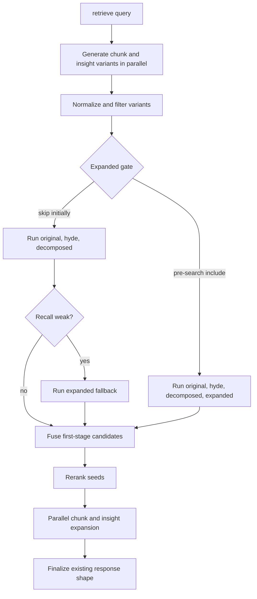
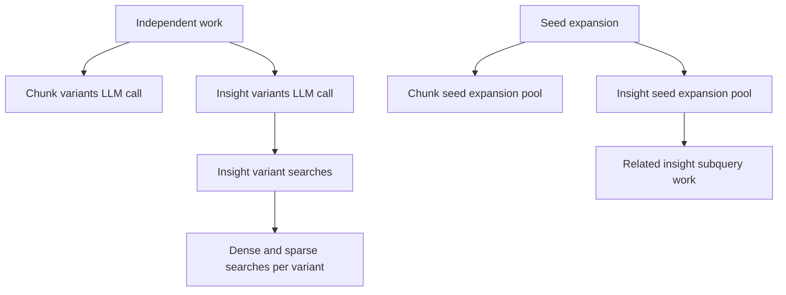

# refactor: Optimize retrieval variant fanout

## Goal Capsule

| Field | Value |
|---|---|
| Objective | Reduce `rag retrieve` wall-clock latency without knowingly reducing retrieval quality. |
| Product authority | The existing retrieval contract remains authoritative: retrieve returns root chunks with related chunk evidence plus insight results. |
| Execution profile | Backend retrieval refactor with CLI/API/MCP surface preservation and live container redeploy. |
| Stop conditions | Stop if quality-preserving behavior cannot be verified with deterministic tests plus live before/after profiling. |
| Tail ownership | The implementer owns code, tests, README updates, backend image rebuild, backend redeploy, and live smoke verification. |

---

## Product Contract

### Summary

This plan optimizes `rag retrieve` by reducing low-value variant fanout and parallelizing independent retrieval work while preserving the current result shape.
The immediate performance target is retrieval latency, not storage reduction.
Search may receive incidental improvements only where shared retrieval helpers are touched.

### Problem Frame

`rag retrieve "insurance triage"` has been observed taking about 2 minutes 20 seconds on the live corpus, while `rag search "insurance triage"` takes about 30 seconds.
The current retrieve path runs chunk and insight variant generation, first-stage dense and sparse searches, reranking, chunk graph expansion, insight graph expansion, generated subqueries, and final reranking.
The first implementation pass should improve latency by removing work that appears low value and running independent work concurrently before changing the core evidence model.

### Requirements

- R1. Preserve the existing retrieve response shape for CLI, REST API, MCP, and answer generation consumers.
- R2. Keep `original` and `hyde` variants in both chunk and insight retrieval because they are the highest-confidence retrieval paths from the observed examples.
- R3. Remove `step_back` from default chunk and insight retrieval fanout.
- R4. Use `expanded` only when a deterministic gate says the query is likely under-specified or when first-stage recall is weak enough to justify fallback expansion.
- R5. Reduce the default maximum decomposed chunk subqueries from 5 to 2; this is the count-bearing default discussed as "expanded to 2."
- R6. Parallelize independent retrieval work where data dependencies do not require sequencing.
- R7. Keep storage cleanup, embedding dimensionality changes, and Memgraph edge pruning out of this pass.
- R8. Update operator documentation and redeploy the backend container after implementation because the live service runs inside Docker.

### Success Criteria

- Retrieval tests cover the variant gating, `step_back` removal, decomposed default change, and parallel execution behavior.
- A refreshed profiling script can measure the current retrieval pipeline without stale monkey-patches.
- Live smoke verification records before/after timing for at least the three sample queries discussed in the investigation.
- `rag retrieve` remains functionally compatible with existing CLI/API/MCP callers.

### Scope Boundaries

#### In Scope

- Retrieval code in `src/rag/retrieval.py`.
- Retrieval settings in `src/rag/config.py`.
- Retrieval prompts in `src/rag/prompts/__init__.py`.
- Tests for retrieval behavior, config defaults, and CLI/API compatibility.
- README updates for defaults, behavior, profiling, and redeploy notes.
- Backend container rebuild and redeploy after code changes.

#### Deferred to Follow-Up Work

- Postgres and Memgraph storage optimization.
- Lower-dimensional embeddings or vector index changes.
- Frontend UX changes for staged or progressive retrieval.
- Adaptive graph expansion or deep-mode semantics.
- Relevance evaluation with a labeled benchmark set.

### Assumptions

- The user’s “default of expanded to 2” means changing `RETRIEVAL_MAX_DECOMPOSED_QUERIES` from 5 to 2; `expanded` remains one optional variant.
- Deterministic gating should be conservative: it may include `expanded` when in doubt, but it should skip it for clear full-sentence queries.
- The backend container must be rebuilt and restarted for these changes to affect the live service; the frontend container does not need rebuilding unless implementation unexpectedly changes frontend-visible API shape.

---

## Planning Contract

### Key Technical Decisions

- KTD1. Treat `step_back` as retired fanout, not merely reweighted.
  The observed examples showed generic or stale broadening, and keeping the prompt output while ignoring the search path would preserve prompt complexity without improving latency.
- KTD2. Make `expanded` a deterministic optional path.
  Use query-shape heuristics before first-stage search, then allow fallback expansion when original plus HyDE results are too sparse or low-confidence.
- KTD3. Keep result-shape compatibility over introducing a new retrieval mode.
  This plan does not add `--deep`, asynchronous enrichment, or progressive output; those may help later but would change operator behavior more than this pass needs.
- KTD4. Parallelize independent work with separate database connections.
  Existing chunk first-stage retrieval already opens per-thread connections; insight retrieval and variant generation should follow that pattern to avoid sharing psycopg connections across threads.
- KTD5. Fix measurement before judging success.
  `scripts/profile_retrieve.py` is stale against current retrieval signatures and function names, so implementation needs a profiler refresh before live timing claims are trusted.

### High-Level Technical Design

### Variant Gate Design

The `expanded` gate should include expansion for short or ambiguous noun phrases and skip it for clear intent-bearing questions.
Candidate signals: meaningful word count, presence of verbs or question words, acronym-like tokens, slash/hyphen shorthand, and first-stage candidate strength.
The fallback gate should trigger only after original plus HyDE and allowed decomposed searches produce too few fused candidates or scores below a configured floor.

### Operational Notes

- The live stack runs backend, frontend, Postgres, and Memgraph through `docker compose`.
- Backend code and README changes require rebuilding and restarting the backend container.
- Frontend rebuild is not expected because this plan preserves API shape.
- Verification should include `docker compose ps`, backend health, and live `rag retrieve` smoke checks after redeploy.

---

## Implementation Units

### U1. Refresh Retrieval Profiling

- **Goal:** Make `scripts/profile_retrieve.py` accurately measure the current retrieval pipeline before and after optimization.
- **Requirements:** R6, Success Criteria.
- **Dependencies:** None.
- **Files:** `scripts/profile_retrieve.py`, `tests/test_retrieval.py`, `tests/test_profile_retrieve.py` if a focused script-level test is clearer than adding more retrieval unit coverage.
- **Approach:** Update wrappers to match current function signatures, include chunk and insight variant generation, insight first-stage retrieval, chunk expansion, insight expansion, reranker calls, embedding calls, SQL calls, and graph calls.
  Keep the script read-only and suitable for live operator use.
- **Patterns to follow:** Existing timing registry and category summary in `scripts/profile_retrieve.py`; trace behavior in `src/rag/retrieval.py`.
- **Test scenarios:**
  - Running the profiler with mocked retrieval functions records variant generation, first-stage retrieval, expansion, reranking, and total time without raising signature errors.
  - A mocked no-insight result still prints a valid category summary.
  - A mocked retrieval error surfaces clearly rather than producing a misleading success report.
- **Verification:** The profiler runs against mocked or local retrieval without stale attribute errors and can be used for live before/after timing.

### U2. Retire Step-Back Variants and Lower Decomposition Default

- **Goal:** Remove `step_back` from default retrieval fanout and reduce default decomposed subqueries to 2.
- **Requirements:** R2, R3, R5.
- **Dependencies:** U1.
- **Files:** `src/rag/config.py`, `src/rag/prompts/__init__.py`, `src/rag/retrieval.py`, `tests/test_config.py`, `tests/test_retrieval.py`, `README.md`, `.env.example` if it documents retrieval defaults.
- **Approach:** Change the default max decomposed queries to 2.
  Remove `step_back` from query-variant prompts and from first-stage variant selection for chunks and insights.
  Keep defensive normalization tolerant of `step_back` in returned JSON so older model responses or tests do not break unexpectedly.
- **Patterns to follow:** Existing `normalize_query_variants()` deduplication and config default tests.
- **Test scenarios:**
  - New `Settings(_env_file=None)` has `RETRIEVAL_MAX_DECOMPOSED_QUERIES == 2`.
  - Chunk first-stage retrieval does not schedule a `step_back` dense or sparse path when a model response contains `step_back`.
  - Insight first-stage retrieval does not schedule a `step_back` path when a model response contains `step_back`.
  - Prompt tests assert variant prompts no longer request `step_back`.
- **Verification:** Unit tests prove `step_back` is absent from scheduled retrieval work while old responses remain harmless.

### U3. Add Deterministic Expanded Variant Gating

- **Goal:** Use `expanded` selectively instead of searching it by default for every retrieve request.
- **Requirements:** R2, R4, R6.
- **Dependencies:** U2.
- **Files:** `src/rag/retrieval.py`, `src/rag/config.py`, `tests/test_retrieval.py`, `tests/test_config.py`, `README.md`.
- **Approach:** Add a small query-shape helper that decides whether `expanded` should be included before first-stage search.
  Include `expanded` for short noun phrases, acronym-heavy queries, and other under-specified terms.
  Skip it for full natural-language questions with clear intent.
  Add a fallback path that can run `expanded` after original plus HyDE and decomposed searches if fused candidate count or candidate quality is weak.
  Keep the heuristic deterministic and locally testable.
- **Patterns to follow:** Existing retrieval settings in `src/rag/config.py`; existing variant scheduling in `run_first_stage_retrieval()` and `run_insight_first_stage_retrieval()`.
- **Test scenarios:**
  - `insurance triage` includes `expanded`.
  - `How to optimize broker submissions with agents` skips `expanded` before fallback.
  - `Biggest challenges in manufacturing right now` skips `expanded` before fallback.
  - A weak first-stage result triggers expanded fallback and merges candidates without duplicate inflation.
  - A strong first-stage result does not run expanded fallback.
- **Verification:** Tests prove the gate is deterministic and that fallback expansion preserves recall when initial candidates are weak.

### U4. Parallelize Independent Retrieval Work

- **Goal:** Reduce wall-clock latency by running independent variant and insight work concurrently.
- **Requirements:** R1, R6.
- **Dependencies:** U2, U3.
- **Files:** `src/rag/retrieval.py`, `tests/test_retrieval.py`.
- **Approach:** Generate chunk and insight variants concurrently because they are independent model calls.
  Parallelize insight first-stage variant searches using separate database connections, mirroring chunk first-stage retrieval.
  Run dense and sparse insight searches independently where connection use is safe.
  Parallelize or batch insight second-hop subquery generation and embeddings for `first_hop[:3]`.
  Consider chunk per-entity expansion batching only where the shared LLM budget and per-seed time budget can be preserved exactly.
- **Patterns to follow:** Existing `ThreadPoolExecutor` use in chunk first-stage retrieval and seed expansion; existing budget lock for graph LLM calls.
- **Test scenarios:**
  - Chunk and insight variant generation both execute and failures still surface to the caller.
  - Insight variant retrieval opens independent connections for concurrent work.
  - Fused insight result ordering remains deterministic for fixed mocked candidate lists.
  - Parallel second-hop insight work dedupes already-seen insight IDs as before.
  - Shared graph LLM budget is not exceeded when parallel paths race.
- **Verification:** Unit tests prove compatible outputs with mocked order variation; profiler shows reduced wall-clock time for independent phases.

### U5. Preserve Public Surfaces and Documentation

- **Goal:** Keep callers compatible while documenting new defaults, tuning behavior, and operator rollout.
- **Requirements:** R1, R8.
- **Dependencies:** U2, U3, U4.
- **Files:** `README.md`, `src/rag/api/schemas.py`, `src/rag/api/routes/retrieve.py`, `src/rag/mcp_server.py`, `tests/test_api.py`, `tests/test_mcp_server.py`, `tests/test_cli_retrieve.py`.
- **Approach:** Avoid changing request or response schemas unless implementation discovers a compelling need.
  Update README retrieval tunables and pipeline description to explain retired `step_back`, gated `expanded`, decomposed default 2, and profiling.
  Add an operational note that backend changes require container rebuild/redeploy.
- **Patterns to follow:** README retrieval defaults and verification sections; existing API/CLI tests that assert retrieve call forwarding.
- **Test scenarios:**
  - CLI retrieve still passes existing options and prints the same JSON shape.
  - API retrieve still accepts existing payload fields and returns retrieval results plus insights.
  - MCP retrieve still exposes the existing tool surface.
  - README no longer documents stale `RETRIEVAL_WEIGHT_STEP_BACK` behavior as an active default.
- **Verification:** CLI/API/MCP tests remain green and docs match the new implementation.

### U6. Live Validation and Backend Redeploy

- **Goal:** Prove the optimization on the running stack and make the live service use the new backend code.
- **Requirements:** R8, Success Criteria.
- **Dependencies:** U1, U2, U3, U4, U5.
- **Files:** `README.md` if rollout notes need adjustment; no feature code expected.
- **Approach:** Capture before/after profiler output and direct timing for the three sample queries.
  Rebuild and restart the backend container after tests pass.
  Confirm health and run smoke retrieval against the live stack.
  Rebuild frontend only if a later implementation choice changes frontend-served assets or API expectations.
- **Patterns to follow:** `scripts/start.sh`, `docker-compose.yml`, README verification section, project `AGENTS.md` guidance for Docker-local services.
- **Test scenarios:**
  - `rag retrieve "insurance triage"` completes and returns the same top-level keys.
  - `rag retrieve "How to optimize broker submissions with agents"` completes and returns chunk and insight sections.
  - `rag retrieve "Biggest challenges in manufacturing right now"` completes without `step_back` traces.
  - Backend health remains ready after redeploy.
- **Verification:** Live timing artifacts show measurable improvement, backend health passes, and smoke retrieval returns valid JSON.

---

## Verification Contract

| Gate | Applies To | Command / Check | Done Signal |
|---|---|---|---|
| Targeted retrieval unit tests | U1-U4 | `pytest -q tests/test_retrieval.py tests/test_config.py` | Variant, gating, parallelism, and config tests pass. |
| Public surface tests | U5 | `pytest -q tests/test_cli_retrieve.py tests/test_api.py tests/test_mcp_server.py` | CLI/API/MCP compatibility remains intact. |
| Prompt/doc consistency | U2, U5 | `pytest -q tests/test_prompts.py` plus README review | Prompt expectations and documented defaults match code. |
| Live profiling | U1, U6 | `venv/bin/python scripts/profile_retrieve.py "<query>"` | Before/after timings are recorded for the three sample queries. |
| Live backend rollout | U6 | Backend container rebuild/restart, health check, and smoke retrieval | Running backend serves optimized code and `/api/health` is ready. |

---

## Definition of Done

- `step_back` is no longer part of scheduled default chunk or insight retrieval.
- `RETRIEVAL_MAX_DECOMPOSED_QUERIES` defaults to 2.
- `expanded` is gated deterministically and can run as a fallback for weak recall.
- Independent retrieval work is parallelized without sharing unsafe database connections.
- The profiler reflects the current code path and supports before/after measurement.
- README documents the new defaults, behavior, verification, and backend redeploy requirement.
- Targeted tests pass.
- Backend container is rebuilt and redeployed on the live stack.
- Live smoke retrieval succeeds for the three sample queries.
- Dead-end implementation experiments are removed from the final diff.

---

## Risks & Dependencies

- **Accuracy regression:** Removing `step_back` and gating `expanded` may reduce recall for some vague queries.
  Mitigation: keep original, HyDE, and two decomposed queries; use expanded fallback when first-stage recall is weak.
- **Concurrency bugs:** Parallel work can create nondeterministic ordering or unsafe shared connection use.
  Mitigation: use per-thread connections and deterministic fusion tests with mocked out-of-order results.
- **Misleading performance claims:** Live timings vary because model APIs and database load vary.
  Mitigation: compare multiple sample queries and separate profiler category totals from end-to-end wall time.
- **Live deploy drift:** Local tests passing does not update the running container.
  Mitigation: include backend rebuild/restart and health/smoke checks in done criteria.

---

## Sources & Research

- `src/rag/retrieval.py` contains variant generation, first-stage retrieval, reranking, chunk expansion, insight expansion, and final result assembly.
- `src/rag/config.py` owns retrieval defaults and tunables.
- `src/rag/prompts/__init__.py` owns query variant prompts.
- `tests/test_retrieval.py` already covers normalization, retrieve orchestration, insight retrieval, and expansion behavior.
- `README.md` documents retrieval defaults, pipeline behavior, and verification shortcuts.
- `docker-compose.yml` and `Dockerfile` show backend code is packaged into the backend image, so live code changes require backend rebuild/redeploy.
