# fix: Reclaim entities bloat and close index/GUC gaps in retrieval

## Goal Capsule

| Field | Value |
|---|---|
| Objective | Reclaim wasted Postgres storage on `entities` and close two verified correctness/latency gaps: a missing Memgraph index/constraint and an uncapped pgvector GUC that silently truncates the dense-retrieval candidate pool. |
| Product authority | Existing `rag search` / `rag retrieve` behavior and result shape remain authoritative; this plan changes storage footprint and internal query mechanics only. |
| Execution profile | Live-database maintenance (Postgres `VACUUM FULL`/`pg_repack`, Memgraph schema statements) plus a small backend code change, executed against the running `docker compose` stack during an approved maintenance window. |
| Stop conditions | Stop if `entities` remediation cannot be verified to actually shrink the table, or if the `hnsw.ef_search` change is shown to regress `rag search`/`rag retrieve` latency beyond an acceptable bound. |
| Tail ownership | The implementer owns the maintenance-window remediation, code changes, tests, README/AGENTS.md updates, backend rebuild/redeploy, and live verification. |

---

## Product Contract

### Summary

This plan fixes three verified, independent problems found by direct inspection of the live stack: (1) the `entities` table in Postgres carries ~3GB of dead TOAST because it has never been autovacuumed, driven by an update/delete-heavy merge script; (2) the live Memgraph instance is missing the `Insight(insight_id)` index and uniqueness constraint that `scripts/init/memgraph_init.cypher` defines, forcing a full label scan on every insight lookup in the `retrieve` hot path; (3) pgvector's `hnsw.ef_search` GUC defaults to 40 and is never raised by the application, so `RETRIEVAL_DENSE_PREFETCH_COUNT=1000` never actually retrieves more than ~40 candidates before exact-cosine reranking. None of these were touched by the retrieval-fanout optimization already shipped in `docs/plans/2026-07-02-001-refactor-retrieval-performance-plan.md` (confirmed live on this branch — `step_back` retired, `RETRIEVAL_MAX_DECOMPOSED_QUERIES=2`, binary-quantized HNSW prefilter in place) or documented in `docs/solutions/performance-issues/rag-retrieval-vector-prefilter-and-query-fanout.md`.

### Problem Frame

Direct inspection of the running stack (`docker compose exec postgres psql`, `docker compose exec memgraph mgconsole`, `EXPLAIN (ANALYZE, BUFFERS)`) found:

- `entities`: 41MB heap + 4.8GB TOAST (measured via `pg_total_relation_size`/`pg_relation_size` on the TOAST relation). Expected TOAST for 113,835 rows × ~16,388 bytes/embedding is ~1.86GB — actual is ~2.6x that. `pg_stat_user_tables.last_autovacuum` is `NULL` for `entities`. `scripts/merge_semantic_duplicates.py::merge_postgres()` runs `UPDATE entities SET aliases = ...` then `DELETE FROM entities WHERE id = ANY(...)` per duplicate cluster, which is exactly the pattern that leaves dead heap/TOAST behind when autovacuum never runs.
- Memgraph: `SHOW INDEX INFO` and `SHOW CONSTRAINT INFO` on the live instance list `Chunk`, `Entity`, `Source` but not `Insight`, even though `scripts/init/memgraph_init.cypher` declares `CREATE INDEX ON :Insight(insight_id);` and a matching unique constraint. `src/rag/graph_db.py` has no startup reconciliation step — Memgraph schema is only ever applied by manually running the init script once, so this is drift, not a fresh-install gap. `retrieval.py`'s `expand_seed_insight`/`_load_related_insights` and `insight_extraction.py`'s per-chunk `MERGE (i:Insight {insight_id: ...})` all do label-scoped lookups by `insight_id` that depend on this index.
- Postgres GUC: `EXPLAIN (ANALYZE, BUFFERS)` on the live `dense_retrieve` prefilter query (`retrieval.py:379-397`, requesting `LIMIT 1000` via `RETRIEVAL_DENSE_PREFETCH_COUNT`) shows the materialized CTE producing only 40 rows. `SHOW hnsw.ef_search` confirms the session default is `40`. The code never issues `SET hnsw.ef_search`, so the binary-quantized HNSW prefilter (`chunks_embedding_binary_hnsw_idx`, `insights_embedding_binary_hnsw_idx`) silently caps every dense-retrieval variant's candidate pool at ~40 regardless of the configured prefetch count, narrowing the pool the exact-cosine rerank stage sees.

None of the three require a schema/data migration in the risky sense — no column types change, no data is lost — but the first requires a maintenance-window lock (`VACUUM FULL`) or extra disk headroom (`pg_repack`), and all three touch the live production stack.

### Requirements

- R1. Reclaim dead TOAST on `entities` so its on-disk size reflects live data (~1.9GB), not ~4.8GB.
- R2. Prevent recurrence: `entities` must receive regular autovacuum/analyze after future merge-script runs, not rely on a one-time manual fix.
- R3. Apply the missing `Insight(insight_id)` index and unique constraint to the live Memgraph instance.
- R4. Prevent recurrence: Memgraph schema statements (index/constraint) must be reconciled automatically rather than depending on someone remembering to re-run `memgraph_init.cypher`.
- R5. Raise `hnsw.ef_search` for dense-retrieval queries so the configured `RETRIEVAL_DENSE_PREFETCH_COUNT` is actually honored, without materially regressing `rag search`/`rag retrieve` latency.
- R6. Preserve existing `rag search`/`rag retrieve` result shape and existing CLI/API/MCP contracts — this plan changes internal query mechanics and storage layout only.
- R7. Update `README.md` and `AGENTS.md` per repo convention, since this plan changes functional behavior (operator-visible latency/storage characteristics and a new startup reconciliation step).

### Success Criteria

- `pg_total_relation_size` on `entities`'s TOAST relation drops to within ~10% of the expected live-data size after remediation.
- `pg_stat_user_tables.last_autovacuum`/`last_vacuum` for `entities` is non-null after a subsequent merge-script run in a test/staging pass.
- `SHOW INDEX INFO` / `SHOW CONSTRAINT INFO` against live Memgraph list `Insight` alongside `Chunk`, `Entity`, `Source`.
- Backend restart reconciles Memgraph schema idempotently (verified by restarting the backend twice and confirming no errors and no duplicate/changed index state).
- `EXPLAIN (ANALYZE, BUFFERS)` on `dense_retrieve`'s prefilter CTE shows row counts approaching the configured `RETRIEVAL_DENSE_PREFETCH_COUNT` (not capped at ~40).
- Targeted and full retrieval/config test suites pass.
- Live before/after timings and table/index sizes are recorded for the three sample queries used in the prior retrieval optimization (`insurance triage`, etc.) plus the size figures in this document.

### Scope Boundaries

#### In Scope

- Postgres: `entities` bloat remediation (`VACUUM FULL` or `pg_repack`), autovacuum threshold tuning, and a post-merge vacuum/analyze step in the duplicate-merge scripts.
- Memgraph: applying the missing `Insight` index/constraint to the live instance, and adding an idempotent startup reconciliation step so schema statements are never silently missing again.
- Postgres: setting `hnsw.ef_search` for dense-retrieval queries in `src/rag/retrieval.py`, sized against `RETRIEVAL_DENSE_PREFETCH_COUNT`.
- Tests covering the above (config defaults, vacuum/reconciliation behavior where testable, dense-retrieve GUC behavior).
- README/AGENTS.md updates for the new defaults, the Memgraph reconciliation step, and the maintenance-window procedure.
- Backend container rebuild/redeploy for the code change; live remediation run against Postgres and Memgraph.

#### Deferred to Follow-Up Work

- Embedding storage precision (`halfvec`/lower-precision embeddings) — explicitly deferred pending a measured quality comparison; not part of this plan.
- Query-variant fanout, LLM-call reduction, and graph-expansion parallelization — already shipped in `docs/plans/2026-07-02-001-refactor-retrieval-performance-plan.md`.
- `sources.markdown_content` vs. `chunks.content` duplication — small (95MB), serves the full-document-view feature by design; not touched here.
- A general-purpose Memgraph migration-tracking system mirroring `scripts/migrate/*.sql` — out of scope; this plan adds only the minimal idempotent reconciliation needed to prevent the specific drift found.
- TOAST compression algorithm changes (`lz4` vs. `pglz`) for text columns — noted as a possible future lever, not sized or verified here.

### Assumptions

- A brief maintenance window (per user confirmation) is available for the `entities` remediation; `VACUUM FULL` is an acceptable default unless implementation finds disk headroom or lock duration makes `pg_repack` clearly preferable.
- Raising `hnsw.ef_search` will be scoped as a targeted `SET LOCAL`/per-connection setting around the dense-retrieval prefilter queries only, not a global Postgres configuration change, to avoid affecting unrelated queries.
- The Memgraph reconciliation step runs at backend startup (mirroring how "Postgres schema is initialized automatically from `scripts/init/postgres/`" per `AGENTS.md`), since `src/rag/graph_db.py` currently has no equivalent step and Memgraph's `CREATE INDEX`/`CREATE CONSTRAINT` statements are safe to re-run (verified live: re-running existing statements produced no error).

---

## Planning Contract

### Key Technical Decisions

- KTD1. Default to `VACUUM FULL` for the one-time `entities` remediation, not `pg_repack`.
  The user confirmed a maintenance window is acceptable, `VACUUM FULL` needs no extra tooling or disk headroom, and `entities` at 41MB heap / 4.8GB TOAST is well within a window-friendly lock duration. `pg_repack` becomes the fallback only if the exclusive lock proves too disruptive during execution.
- KTD2. Treat the merge-script bloat as a recurring-cause problem, not just a one-time cleanup.
  `merge_semantic_duplicates.py` (and its sibling `merge_duplicate_entities.py`, which shares the same `merge_postgres` pattern) will keep generating dead rows on every run. Fix the cause (missing post-run vacuum/analyze, and autovacuum thresholds tuned for `entities`' update/delete pattern) rather than only reclaiming the current bloat.
- KTD3. Apply Memgraph schema reconciliation idempotently at backend startup rather than building a versioned migration system.
  Memgraph `CREATE INDEX`/`CREATE CONSTRAINT` statements are safe to re-run (verified live). A small idempotent reconciliation function run once at startup closes the exact gap found (schema statements applied manually and never re-applied after `Insight` was added) without introducing a new migration-tracking mechanism, which is explicitly deferred.
- KTD4. Scope the `hnsw.ef_search` fix to dense-retrieval query execution, not a server-wide Postgres setting.
  A per-connection `SET` (or `SET LOCAL` inside the existing transaction/session used for the prefilter query) keeps the blast radius limited to the queries that need a wider candidate pool, and keeps the change easy to size/tune/revert independently of other Postgres traffic.
- KTD5. Size `hnsw.ef_search` relative to `RETRIEVAL_DENSE_PREFETCH_COUNT`, verified empirically, not set to an arbitrary large constant.
  Higher `ef_search` costs more per-query latency inside the HNSW candidate search. The implementer should measure candidate-pool size and query latency at a small number of candidate values (e.g., proportional to `RETRIEVAL_DENSE_PREFETCH_COUNT`, and one lower step) and choose the smallest value that reliably reaches the configured prefetch count, rather than over-provisioning.

### High-Level Technical Design

```mermaid
flowchart TB
  subgraph Postgres["Postgres: entities bloat"]
    A1[merge_semantic_duplicates.py / merge_duplicate_entities.py] -->|UPDATE + DELETE per cluster| A2[(entities table)]
    A2 -->|dead TOAST accumulates, no autovacuum| A3[VACUUM FULL / pg_repack one-time reclaim]
    A1 -->|after each run| A4[Post-run VACUUM ANALYZE entities]
    A5[Tuned autovacuum thresholds on entities] --> A2
  end

  subgraph Memgraph["Memgraph: missing Insight schema"]
    B1[scripts/init/memgraph_init.cypher] -.->|declares but never re-applied| B2[(live Memgraph instance)]
    B3[Backend startup reconciliation] -->|idempotent CREATE INDEX/CONSTRAINT| B2
  end

  subgraph Retrieval["Postgres: dense_retrieve GUC gap"]
    C1[dense_retrieve / insight dense retrieve] -->|prefilter query| C2[(chunks/insights binary HNSW index)]
    C2 -->|hnsw.ef_search=40 default caps candidates ~40| C3[Exact cosine rerank sees too few candidates]
    C4[SET hnsw.ef_search sized to RETRIEVAL_DENSE_PREFETCH_COUNT] --> C2
  end
```

### Sizing hnsw.ef_search

Measure candidate-pool size (via `EXPLAIN (ANALYZE, BUFFERS)` on the materialized prefilter CTE) and end-to-end query latency at a small set of `hnsw.ef_search` values, starting near `RETRIEVAL_DENSE_PREFETCH_COUNT` and one step below it. Pick the smallest value that reliably returns a candidate count close to the configured prefetch count across a few representative queries, and record the latency delta versus the current (uncapped-in-effect, ~40-candidate) baseline. This is an empirical sizing step, not a fixed default to assume in advance.

---

## Implementation Units

### U1. Reclaim `entities` Bloat and Tune Autovacuum

- **Goal:** Shrink `entities`'s TOAST footprint back to expected live-data size and make autovacuum keep it there.
- **Requirements:** R1, R2.
- **Dependencies:** None.
- **Files:** `scripts/` (new one-off remediation script or documented ad-hoc command), `README.md`, `AGENTS.md`.
- **Approach:** Run `VACUUM FULL entities;` against the live Postgres container during the maintenance window (per KTD1); fall back to `pg_repack -t entities` only if lock duration proves disruptive. Before running, capture current sizes (`pg_total_relation_size`, TOAST breakdown) as the baseline. After running, tune `autovacuum_vacuum_scale_factor`/`autovacuum_vacuum_threshold` for `entities` (via `ALTER TABLE entities SET (...)`) to a lower threshold appropriate for its low insert-rate, update/delete-heavy access pattern, so future dead rows from merge runs get reclaimed automatically instead of waiting on the default scale factor across a large table.
- **Patterns to follow:** Existing ad-hoc SQL invocation convention in `AGENTS.md` (`docker compose exec -T postgres psql -U rag -d rag -f ...` / `-c "..."`).
- **Test scenarios:**
  - Test expectation: none -- this is a live database operation and threshold configuration change, not application code; correctness is verified via the size/vacuum checks in Verification, not unit tests.
- **Verification:** `pg_total_relation_size` on `entities` (heap + TOAST) is within ~10% of the expected ~1.9GB live-data estimate after remediation; `ALTER TABLE ... SET` autovacuum parameters are confirmed via `\d+ entities` or `pg_class.reloptions`.

### U2. Batch Merge-Script Vacuum to Prevent Recurrence

- **Goal:** Stop future `merge_semantic_duplicates.py`/`merge_duplicate_entities.py` runs from re-accumulating the same class of dead-row bloat unnoticed.
- **Requirements:** R2.
- **Dependencies:** U1.
- **Files:** `scripts/merge_semantic_duplicates.py`, `scripts/merge_duplicate_entities.py`, `tests/` (new or existing test file covering these scripts, if one exists — otherwise a focused test module).
- **Approach:** After a merge run completes (all clusters processed), issue `VACUUM (ANALYZE) entities` as an explicit post-run step in both scripts, gated so it only runs when the script actually performed updates/deletes (skip on a dry run or a run with zero merges). Log the vacuum step so operators can see it happened in script output.
- **Patterns to follow:** Existing `merge_cluster()`/`main()` structure and dry-run gating already present in `scripts/merge_semantic_duplicates.py`.
- **Test scenarios:**
  - Running the merge script with at least one real merge triggers the post-run vacuum step (mock the DB call and assert it was invoked).
  - Running the merge script in dry-run mode does not trigger the vacuum step.
  - Running the merge script with zero duplicate clusters found does not trigger the vacuum step.
- **Verification:** Unit tests confirm the vacuum call fires exactly when expected; a live re-run of the merge script (if duplicates exist) shows `pg_stat_user_tables.last_vacuum` updated for `entities` afterward.

### U3. Apply Missing Memgraph Insight Index and Constraint (Live Fix)

- **Goal:** Close the immediate gap on the running Memgraph instance so `Insight` lookups stop doing full label scans.
- **Requirements:** R3.
- **Dependencies:** None.
- **Files:** None (live `mgconsole` operation); optionally a small remediation note in `AGENTS.md` or `docs/solutions/` if this repo's convention captures such fixes there.
- **Approach:** Run `CREATE INDEX ON :Insight(insight_id);` and `CREATE CONSTRAINT ON (i:Insight) ASSERT i.insight_id IS UNIQUE;` against the live Memgraph instance via `mgconsole`, matching the statements already present in `scripts/init/memgraph_init.cypher`. Confirm via `SHOW INDEX INFO`/`SHOW CONSTRAINT INFO` that `Insight` now appears alongside `Chunk`, `Entity`, `Source`.
- **Patterns to follow:** `AGENTS.md`'s documented `printf "<cypher>\n" | docker compose exec -T memgraph mgconsole` invocation pattern.
- **Test scenarios:**
  - Test expectation: none -- this is a one-time live schema statement, superseded by the automatic reconciliation added in U4; verified directly via `SHOW INDEX INFO`/`SHOW CONSTRAINT INFO`.
- **Verification:** `SHOW INDEX INFO` and `SHOW CONSTRAINT INFO` list `Insight(insight_id)` index and unique constraint on the live instance.

### U4. Add Idempotent Memgraph Schema Reconciliation at Backend Startup

- **Goal:** Prevent this exact class of drift (schema statements defined in `memgraph_init.cypher` but never re-applied to a running instance) from recurring silently.
- **Requirements:** R4.
- **Dependencies:** U3.
- **Files:** `src/rag/graph_db.py`, `scripts/init/memgraph_init.cypher` (read from, not duplicated), backend startup/lifespan wiring (wherever the FastAPI app's startup hook lives, per existing lifespan pattern), `tests/test_graph_db.py` (new, if none exists) or an existing graph-related test module.
- **Approach:** Add a small reconciliation function that runs the index/constraint statements from `scripts/init/memgraph_init.cypher` (or an equivalent explicit statement list co-located with `graph_db.py` to avoid parsing the `.cypher` file at runtime) against the live driver once at backend startup. Since Memgraph's `CREATE INDEX`/`CREATE CONSTRAINT` are safe to re-run (verified live), this is a pure idempotent reconciliation, not a stateful migration tracker — keep it deliberately minimal per KTD3 and the deferred general migration-system scope.
- **Patterns to follow:** Existing FastAPI `lifespan` pattern already used for the MCP sub-app's session manager (per `AGENTS.md`'s MCP server notes) as the place to hook a startup-time step.
- **Test scenarios:**
  - Startup reconciliation runs all expected `CREATE INDEX`/`CREATE CONSTRAINT` statements against a fake/mock driver and does not raise.
  - Running reconciliation twice in a row (simulating a restart) does not raise or duplicate anything (mock driver records calls; assert idempotent statements are reissued, not skipped incorrectly).
  - A Memgraph connection failure during startup reconciliation surfaces clearly rather than silently swallowing the error (matches existing supervisor/worker error-surfacing conventions).
- **Verification:** Restarting the backend container twice against the live stack shows no errors, and `SHOW INDEX INFO`/`SHOW CONSTRAINT INFO` remain stable (no duplicate or changed entries) after each restart.

### U5. Fix `hnsw.ef_search` Under-Fetch in Dense Retrieval

- **Goal:** Make `RETRIEVAL_DENSE_PREFETCH_COUNT` actually govern the candidate pool size seen by exact-cosine reranking, instead of being silently capped at ~40 by the pgvector default.
- **Requirements:** R5, R6.
- **Dependencies:** None (independent of U1-U4).
- **Files:** `src/rag/retrieval.py` (`dense_retrieve`, insight dense-retrieve counterpart), `src/rag/config.py` (new setting if the target `ef_search` value should be configurable rather than derived), `tests/test_retrieval.py`, `README.md`.
- **Approach:** In `dense_retrieve` and the analogous insight dense-retrieve function, issue a `SET hnsw.ef_search = <value>` (or `SET LOCAL` if the query runs inside an explicit transaction) on the connection immediately before running the prefilter CTE, sized per the "Sizing hnsw.ef_search" guidance above (KTD5). Prefer deriving the value from `RETRIEVAL_DENSE_PREFETCH_COUNT` (e.g., a config-driven multiplier or explicit new setting) over a hardcoded constant, so future prefetch-count tuning doesn't silently reintroduce this gap.
- **Patterns to follow:** Existing `conn.execute(...)` usage and parameterization style already in `dense_retrieve`/`sparse_retrieve`.
- **Test scenarios:**
  - `dense_retrieve` issues a `SET hnsw.ef_search` statement before the prefilter query when `RETRIEVAL_DENSE_PREFETCH_COUNT > top_n` (mock the connection and assert the statement was executed with the expected value).
  - The insight dense-retrieve counterpart does the same.
  - When `RETRIEVAL_DENSE_PREFETCH_COUNT <= top_n` (the non-prefetch code path), no `SET hnsw.ef_search` call is made, matching existing branch behavior.
  - A configured `ef_search` value is correctly derived from `RETRIEVAL_DENSE_PREFETCH_COUNT` per whatever derivation rule implementation settles on (e.g., equal to it, or a documented ratio).
- **Verification:** `EXPLAIN (ANALYZE, BUFFERS)` on the live prefilter query, run after the fix, shows the materialized CTE producing a row count close to the configured `RETRIEVAL_DENSE_PREFETCH_COUNT` rather than ~40; targeted retrieval tests pass; live `rag search`/`rag retrieve` timing for the three sample queries used in the prior optimization does not regress beyond an acceptable bound recorded during sizing.

### U6. Documentation, Backend Redeploy, and Live Validation

- **Goal:** Ship the code change, document the new defaults/behavior, and prove all three fixes hold on the live stack.
- **Requirements:** R6, R7, Success Criteria.
- **Dependencies:** U1, U2, U3, U4, U5.
- **Files:** `README.md`, `AGENTS.md`.
- **Approach:** Update `README.md`/`AGENTS.md` with: the new `hnsw.ef_search` behavior and its config knob, the Memgraph startup reconciliation step, the autovacuum tuning applied to `entities`, and the maintenance-window procedure used for the one-time bloat reclaim (for future reference if it needs to be repeated on other bloated tables). Rebuild and restart the backend container for the `retrieval.py`/`graph_db.py` changes. Re-run the size/`EXPLAIN`/`SHOW INDEX INFO` checks from Success Criteria against the live stack and record before/after numbers alongside the three sample-query timings used in the prior retrieval optimization.
- **Patterns to follow:** `docker-compose.yml`/`scripts/start.sh` redeploy pattern and README verification section already established by the prior retrieval-performance plan; `AGENTS.md`'s database-access conventions.
- **Test scenarios:**
  - Test expectation: none -- this unit is documentation, deployment, and live verification, not new application logic; covered by the Success Criteria checks and the Verification Contract below.
- **Verification:** Backend health (`/api/health`) is ready after redeploy; live `rag search`/`rag retrieve` smoke runs return valid results; recorded before/after figures show `entities` size reclaimed, `Insight` index/constraint present, and prefilter candidate counts no longer capped at ~40.

---

## Verification Contract

| Gate | Applies To | Command / Check | Done Signal |
|---|---|---|---|
| Postgres size/vacuum checks | U1, U2, U6 | `pg_total_relation_size`/TOAST breakdown query, `pg_stat_user_tables` for `entities` | `entities` size within ~10% of expected live-data size; `last_vacuum`/`last_autovacuum` populated after a merge run |
| Merge-script vacuum tests | U2 | `pytest -q` targeted at the merge-script test module | Vacuum-trigger tests pass for real-merge, dry-run, and zero-merge cases |
| Memgraph schema checks | U3, U4 | `SHOW INDEX INFO;` / `SHOW CONSTRAINT INFO;` via `mgconsole` | `Insight(insight_id)` index and unique constraint present; stable across repeated backend restarts |
| Reconciliation unit tests | U4 | `pytest -q tests/test_graph_db.py` (or equivalent) | Reconciliation runs against a mock driver without raising, twice in a row |
| Dense-retrieval GUC tests | U5 | `pytest -q tests/test_retrieval.py tests/test_config.py` | `SET hnsw.ef_search` issued exactly when expected; existing retrieval tests remain green |
| Live EXPLAIN check | U5, U6 | `EXPLAIN (ANALYZE, BUFFERS)` on the live prefilter query | Materialized CTE row count approaches configured `RETRIEVAL_DENSE_PREFETCH_COUNT` |
| Full retrieval/API surface regression | U6 | `pytest -q tests/test_retrieval.py tests/test_cli_retrieve.py tests/test_cli_search.py tests/test_api.py tests/test_config.py` | No regressions in existing retrieval/search/API behavior |
| Live backend rollout | U6 | Backend container rebuild/restart, `docker compose ps`, `/api/health`, live smoke `rag search`/`rag retrieve` | Backend serves updated code; health ready; smoke queries succeed |

---

## Definition of Done

- `entities` TOAST size is reclaimed to within ~10% of expected live-data size, and autovacuum thresholds are tuned so it does not silently re-bloat.
- `merge_semantic_duplicates.py` and `merge_duplicate_entities.py` vacuum/analyze `entities` after runs that perform merges.
- Live Memgraph has the `Insight(insight_id)` index and unique constraint.
- Backend startup idempotently reconciles Memgraph schema statements, verified stable across repeated restarts.
- `dense_retrieve` and insight dense-retrieve set `hnsw.ef_search` so the configured `RETRIEVAL_DENSE_PREFETCH_COUNT` is actually honored, sized empirically per the tradeoff in Planning Contract.
- `rag search`/`rag retrieve` result shape and existing CLI/API/MCP contracts are unchanged.
- README/AGENTS.md document the new defaults, the reconciliation step, and the maintenance procedure.
- Targeted and full test suites pass.
- Backend is rebuilt and redeployed on the live stack; before/after sizes, index presence, candidate-pool counts, and sample-query timings are recorded.

---

## Risks & Dependencies

- **Lock contention during `VACUUM FULL`:** An exclusive lock on `entities` blocks reads/writes for the operation's duration.
  Mitigation: run during the approved maintenance window; fall back to `pg_repack` (KTD1) if the measured lock duration proves too disruptive.
- **`hnsw.ef_search` latency/recall tradeoff:** Raising it too high adds per-query latency; too low leaves the under-fetch bug effectively unfixed.
  Mitigation: empirical sizing step (Planning Contract) across representative queries before committing to a default.
- **Memgraph reconciliation runs on every backend start:** If the statements are ever changed to something non-idempotent, repeated runs could error or duplicate state.
  Mitigation: keep the reconciliation statement list limited to genuinely idempotent `CREATE INDEX`/`CREATE CONSTRAINT` forms (verified live in this plan); do not expand it into arbitrary schema changes without re-verifying idempotency.
- **Autovacuum tuning drift:** Threshold changes on `entities` are a targeted fix; if row-count or update patterns change substantially later, thresholds may need revisiting.
  Mitigation: documented in README/AGENTS.md so future operators know why the setting exists and can retune it.
- **Concurrent work on `src/rag/retrieval.py`:** The already-shipped fanout plan (`docs/plans/2026-07-02-001-...`) also touches `retrieval.py`. This plan's changes (U5) are additive (a `SET` call around existing prefilter queries) and should not conflict, but implementers should diff against the current `retrieval.py` state before starting U5 rather than assuming the file matches what's quoted here.

---

## Sources & Research

- Live Postgres inspection: `pg_catalog.pg_statio_user_tables`, `pg_stat_user_tables`, TOAST relation size queries, `EXPLAIN (ANALYZE, BUFFERS)` on `dense_retrieve`'s prefilter CTE, `SHOW hnsw.ef_search`.
- Live Memgraph inspection: `SHOW INDEX INFO;`, `SHOW CONSTRAINT INFO;` via `mgconsole`.
- `scripts/init/memgraph_init.cypher` — declares the `Insight` index/constraint missing from the live instance.
- `scripts/merge_semantic_duplicates.py` (`merge_postgres`, `merge_cluster`, `main`) and `scripts/merge_duplicate_entities.py` — source of the update/delete pattern driving `entities` bloat.
- `src/rag/retrieval.py` (`dense_retrieve`, `sparse_retrieve`, insight dense-retrieve counterpart, `expand_seed_insight`, `_load_related_insights`) and `src/rag/graph_db.py`, `src/rag/config.py`.
- `scripts/migrate/002_update_vector_dimensions.sql`, `007_insights.sql`, `009_binary_vector_prefilter_indexes.sql` — establish why embeddings are 4096-dim, uncompressed, and why the binary-quantized prefilter pattern exists.
- `docs/plans/2026-07-02-001-refactor-retrieval-performance-plan.md` and `docs/solutions/performance-issues/rag-retrieval-vector-prefilter-and-query-fanout.md` — confirm the retrieval-fanout and binary-index work is already shipped and out of scope here.
- `AGENTS.md` — database access conventions, Docker-local service assumptions, MCP/backend lifespan pattern.
- External research: not run. This plan is grounded entirely in direct, verified inspection of the live local stack (Postgres/Memgraph introspection and code reading); the mechanisms involved (Postgres `VACUUM`/autovacuum, pgvector `hnsw.ef_search`, Memgraph `CREATE INDEX`/`CREATE CONSTRAINT`) were confirmed empirically against this repo's actual running instances rather than general documentation.
