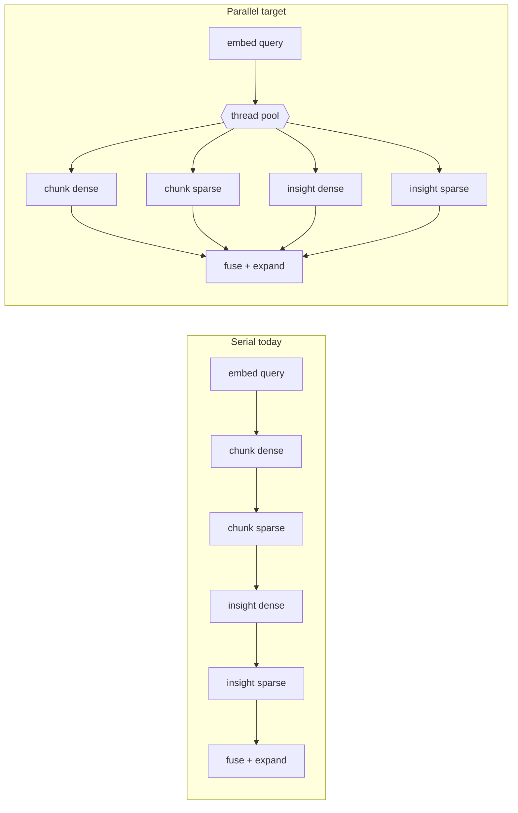

# Search and Retrieve Latency Reliability - Plan

## Goal Capsule

| Field | Value |
|---|---|
| Objective | `rag search` returns in under 2s and `rag retrieve` in under 30s on **every** query — including the first query after a backend/Postgres restart or maintenance — without reducing retrieval depth (candidate pools, variants, expansion). |
| Product authority | Existing `rag search` / `rag retrieve` result shape and CLI/API/MCP contracts remain authoritative; this plan changes memory configuration, startup warmup, and internal query concurrency only. |
| Execution profile | Small backend code change plus Docker Compose/Postgres configuration change against the live `docker compose` stack; requires one Postgres container restart and a backend image rebuild/redeploy. |
| Stop conditions | Stop if `shared_buffers` cannot be verified to actually apply (`SHOW shared_buffers`), if prewarming fails to bring cold-start within targets, or if parallelizing search changes any result ordering/shape in the test suites. |
| Tail ownership | The implementer owns the compose change, migration, code, tests, README/AGENTS.md updates, backend rebuild/redeploy, Postgres restart, and live cold+warm verification. |

---

## Product Contract

### Summary

Make search/retrieve latency reliable by fixing the memory layer and the search hot path: (1) make Postgres memory settings actually take effect, (2) prewarm the binary HNSW prefilter indexes at backend startup, and (3) run `rag search`'s serial queries in parallel. Retrieval depth (prefetch 250, variants, graph expansion) is unchanged.

### Problem Frame

After the ef_search fix landed (prefetch honored at 250 instead of silently capped at 40), the user observed `rag search` at ~13s and `rag retrieve` at ~80s. Controlled live measurement on the current branch showed the regression is cold-cache behavior, not a durable code regression:

| Condition | `rag search` | `rag retrieve` |
|---|---|---|
| First query after ~1h-old backend restart (cold) | 22.6s | 27.5s |
| Warm repeats (same + fresh query) | 3.3–3.6s | 26.2s |

Root causes verified on the live stack:

- Postgres runs with `shared_buffers = 128MB` (server default) against a 6.6GB database. `docker-compose.yml` declares `POSTGRES_SHARED_BUFFERS: 512MB`, but the ParadeDB image ignores that env var — the setting looks configured and is not. The two binary HNSW prefilter indexes (`chunks_embedding_binary_hnsw_idx` 100MB, `insights_embedding_binary_hnsw_idx` 86MB) cannot stay resident, so restarts and cache pressure evict them and the next query pages them back from disk.
- Nothing prewarms those indexes after a restart or `VACUUM FULL`; `pg_prewarm` is available in the image but not installed.
- `hybrid_search()` (`src/rag/retrieval.py:488-499`) runs chunk dense, chunk sparse, and insight dense+sparse **serially on one shared connection** — the retrieve path parallelizes variants but search never got that treatment. Warm search is ~3.3s against a <2s target.

### Requirements

Memory and cold-start reliability:
- R1. Postgres server settings (`shared_buffers`, `effective_cache_size`, `work_mem`, `maintenance_work_mem`, `max_connections`) must verifiably apply to the running server — `SHOW <setting>` reflects the configured value after restart.
- R2. The binary HNSW prefilter indexes are prewarmed into buffers after **any** restart — backend restart, Postgres-only restart, or a post-`VACUUM FULL` cache flush — so the first query after any of these meets the same latency targets as warm queries.
- R3. Prewarming must be non-fatal: Postgres unavailability or a missing extension must not prevent backend startup or break tests that trigger the FastAPI lifespan (same lesson as the Memgraph reconciliation hard-fail — see `docs/solutions/database-issues/postgres-toast-bloat-memgraph-schema-drift-and-hnsw-ef-search-cap.md`). The lifespan prewarm hook must survive a Postgres-not-yet-ready race after `docker compose restart` (which does not gate on the healthcheck) via a short non-blocking retry rather than a single best-effort attempt.

Search hot path:
- R4. `hybrid_search()` runs its independent first-stage queries (chunk dense, chunk sparse, insight dense, insight sparse) concurrently instead of serially.
- R5. Search result shape, scores, ordering semantics, and the `limit`/`min_score` contract are unchanged for CLI, REST API, and MCP consumers.

Depth preservation and durability:
- R6. `RETRIEVAL_DENSE_PREFETCH_COUNT` stays at 250 for all surfaces; no variant, seed count, expansion budget, or candidate pool is reduced.
- R7. All changes are durable for fresh installs (compose file, `scripts/init/postgres/`) and existing deployments (a `scripts/migrate/` file), not just applied live by hand.
- R8. `README.md` and `AGENTS.md` are updated (repo rule for functionally visible changes), including recorded cold and warm before/after timings.

### Success Criteria

- After `docker compose restart postgres backend`, the **first** `rag search` completes in <2s and the first `rag retrieve` in <30s. Because both paths open with a remote model call (embedding for search, variant-generation LLMs for retrieve) that has no tail-latency bound, the target is measured as the median of 3 runs per sample query, not a single-shot absolute for every call.
- After a **Postgres-only** `docker compose restart postgres` (backend left running), the first `rag search` still meets the <2s target — proving the autoprewarm layer, not just the lifespan hook, is doing its job.
- Warm `rag search` <2s and warm `rag retrieve` <30s across the three sample queries used in prior optimization work (`insurance triage`, etc.).
- `SHOW shared_buffers` (2GB), `SHOW max_connections` (100), and the other tuned settings return their configured values on the live container.
- Backend startup logs record `pg_prewarm` block counts for both binary HNSW indexes consistent with their on-disk `pg_relation_size` block counts. (pg_prewarm returns blocks processed, not a residency view — this log-plus-block-count check is the checkable proxy, not a `pg_buffercache` inspection the plan doesn't install.)
- Retrieval/search test suites pass, including `tests/test_hybrid_search.py`; no result-shape change in `tests/test_retrieval.py`, `tests/test_cli_search.py`, `tests/test_api.py`.

### Scope Boundaries

#### In Scope
- Docker Compose Postgres memory configuration and its verification.
- `pg_prewarm` extension install (init + migration) and a startup prewarm hook.
- Parallelizing `hybrid_search()`'s first-stage queries.
- Documentation and live cold/warm timing verification.

#### Deferred to Follow-Up Work
- A separate, lower prefetch knob for search only (Option C from the brainstorm) — pull in only if A+B still miss the <2s search target; it trades search rerank-pool depth.
- Retrieve-path code changes (variant gating, expansion tuning) — retrieve is ~26s warm and gains headroom from the memory fix; revisit only if targets are missed.
- Profiling coverage for `rag search` in `scripts/profile_retrieve.py` (it currently wraps retrieve internals only).

#### Out of Scope
- Any reduction of retrieval depth: prefetch counts, variant sets, seed counts, graph expansion budgets.
- Embedding dimensionality or index-type changes.
- Reverting the ef_search fix.

---

## Planning Contract

### Key Technical Decisions

- KTD1. **Apply all Postgres server settings via explicit `-c` arguments, not image env vars.** The live server proves the ParadeDB image ignores `POSTGRES_SHARED_BUFFERS` (live `shared_buffers=128MB` despite compose declaring 512MB) and `POSTGRES_MAX_CONNECTIONS` (live `max_connections=100` despite compose declaring 50). Pass every tuned setting — `shared_buffers`, `effective_cache_size`, `work_mem`, `maintenance_work_mem`, `max_connections` — as a `command:` `-c` argument, keeping the existing env var names as the interpolation source so operator overrides keep working. Verification (`SHOW <setting>` for each) is part of done — this repo has now hit the "config looks right but runtime disagrees" pattern repeatedly (ef_search, Memgraph schema, shared_buffers, max_connections).
- KTD2. **Defaults: `shared_buffers` 2GB, `effective_cache_size` 4GB, `work_mem` 64MB, `maintenance_work_mem` 256MB, `max_connections` 100.** 2GB shared_buffers comfortably holds both HNSW prefilter indexes (~186MB), hot heap pages, and FTS indexes with headroom while staying modest for a personal host. `max_connections` default is raised to 100 to match the server's *actual current* value — dropping it to the compose-declared 50 would be a silent capacity reduction. All remain env-overridable.
- KTD3. **Prewarm only the two binary HNSW prefilter indexes.** They are the cold-start cliff (every dense query walks them) and fit in buffers. The full-precision embedding TOAST (multi-GB) cannot fit and is touched only for ~250 rows per query — not worth prewarming.
- KTD4. **Two-layer prewarm: pg_prewarm autoprewarm worker (durable) + a lifespan hook (immediate).** A backend-lifespan hook alone only fires when the backend process starts, so a Postgres-only restart, crash, or post-`VACUUM FULL` cache flush under a still-running backend would leave cold buffers — recreating the diagnosed failure one layer up. Enable pg_prewarm's `autoprewarm` background worker (`-c shared_preload_libraries=pg_prewarm`) so Postgres re-warms its own buffers after *any* restart. Keep the FastAPI lifespan hook (in `src/rag/db.py` alongside `vacuum_analyze_entities()`, wrapped non-fatally like the Memgraph reconciliation) for the first-install case and for immediate warmth without waiting for the autoprewarm dump interval. The lifespan hook must tolerate Postgres-not-yet-ready via a short non-blocking retry, since `docker compose restart` does not gate on the healthcheck.
- KTD5. **Parallelize search with `ThreadPoolExecutor` and per-thread connections, mirroring `run_first_stage_retrieval` (`src/rag/retrieval.py:894-957`).** Not an asyncio rewrite — the retrieve path already establishes the thread+connection-per-worker convention, psycopg connections are not thread-safe to share, and `max_connections=100` (live-verified) has ample headroom for 4 concurrent search queries.
- KTD6. **The query embedding call stays first and serial.** All four first-stage queries need the vector (dense) or nothing (sparse); sparse queries could start before the embedding returns, which the implementer may exploit, but the contract is only R4's concurrency of the four queries. The embedding call is a remote API with no tail-latency bound, so the search target is measured allowing that variance (see Success Criteria), not as a single-shot absolute for every call.

### High-Level Technical Design

`hybrid_search` first stage, before → after:

Expected warm search budget: embedding (~0.5–1.0s) + max of the four queries (~0.75s dense at prefetch 250, less once buffers hold the indexes) + fusion/expansion (~0.2s) ≈ 1.5–1.9s. Cold-start budget relies on U1+U2 keeping the dense queries at their warm cost.

### Assumptions

- The user's 13s/80s observations were cold-cache events (and/or taken while prefetch was 1000 before the final rebuild); no unexplained durable regression exists beyond what this plan addresses. If post-implementation cold measurements contradict this, stop and re-diagnose rather than tuning further.
- The Docker host has ~2GB additional memory headroom for Postgres. If the Docker VM memory limit makes 2GB infeasible, 1GB still holds both indexes with headroom — the env override exists for this.
- The ParadeDB image accepts standard `postgres -c` command arguments including `shared_preload_libraries` (standard entrypoint behavior); U1 verification confirms. If the image wraps its own entrypoint and ignores `command:`, fall back to its documented config mechanism (a mounted `postgresql.conf` or its own env passthrough) — the goal is that `SHOW` reflects the values, by whatever mechanism the image honors.
- KTD3 attributes the cold search gap primarily to paging the two binary HNSW indexes. Cold FTS and heap pages for the sparse legs also page in and are not prewarmed; if a targeted cold measurement after U1+U2 shows search still misses <2s, prewarming the FTS/heap or pulling in Option C is the next lever — stop and measure rather than assuming.

---

## Implementation Units

### U1. Make Postgres server settings actually apply, and preload pg_prewarm

**Goal:** All tuned settings verifiably apply to the running Postgres, and the `autoprewarm` background worker is loaded so buffers survive any restart.
**Requirements:** R1, R2, R6, R7
**Dependencies:** none
**Files:** `docker-compose.yml`, `.env.example`, `README.md`
**Approach:** Add a `command:` to the postgres service passing every tuned setting as a `-c` argument sourced from the existing env vars: `-c shared_buffers=${POSTGRES_SHARED_BUFFERS:-2GB} -c effective_cache_size=${POSTGRES_EFFECTIVE_CACHE_SIZE:-4GB} -c work_mem=${POSTGRES_WORK_MEM:-64MB} -c maintenance_work_mem=${POSTGRES_MAINTENANCE_WORK_MEM:-256MB} -c max_connections=${POSTGRES_MAX_CONNECTIONS:-100} -c shared_preload_libraries=pg_prewarm -c pg_prewarm.autoprewarm=on`. Raise the compose default for `POSTGRES_SHARED_BUFFERS` from 512MB to 2GB and `POSTGRES_MAX_CONNECTIONS` from 50 to 100 (the live server already runs 100 — dropping to 50 would silently shed capacity). Confirm the ParadeDB entrypoint passes `command:` through to `postgres` (standard behavior; if it wraps its own entrypoint, use the image's documented `-c` mechanism instead). Keep env vars as the single override surface; document `POSTGRES_EFFECTIVE_CACHE_SIZE` in `.env.example`.
**Patterns to follow:** existing `${VAR:-default}` interpolation style in `docker-compose.yml`.
**Test scenarios:** Test expectation: none — compose configuration; verified live (below).
**Verification:** `docker compose up -d postgres` then `docker compose exec -T postgres psql -U rag -d rag -c "SHOW shared_buffers; SHOW effective_cache_size; SHOW work_mem; SHOW maintenance_work_mem; SHOW max_connections; SHOW shared_preload_libraries;"` returns the configured values with `pg_prewarm` present in `shared_preload_libraries`. Existing data survives the restart (`SELECT count(*) FROM chunks`).

### U2. Prewarm binary HNSW indexes: autoprewarm worker + non-fatal lifespan hook

**Goal:** The first dense query after **any** restart — backend, Postgres-only, or post-`VACUUM FULL` — pays no index-paging penalty.
**Requirements:** R2, R3, R7
**Dependencies:** U1 (buffers must be large enough to hold what's prewarmed, and `shared_preload_libraries=pg_prewarm` must be set for autoprewarm)
**Files:** `scripts/migrate/011_pg_prewarm.sql`, `scripts/init/postgres/` (extension creation for fresh installs), `src/rag/db.py`, `src/rag/api/main.py`, a `tests/test_db.py` (new; nearest existing home if one fits better), `tests/test_mcp_server.py` (must keep passing without live Postgres)
**Approach:** Two layers. **(a) Durable — autoprewarm:** migration + init run `CREATE EXTENSION IF NOT EXISTS pg_prewarm;`. With `shared_preload_libraries=pg_prewarm` + `pg_prewarm.autoprewarm=on` set in U1, Postgres periodically dumps the buffer list and reloads it on any startup — covering Postgres-only restarts the backend never sees. **(b) Immediate — lifespan hook:** add `prewarm_vector_indexes()` to `src/rag/db.py` following `vacuum_analyze_entities()`'s own-autocommit-connection pattern: `SELECT pg_prewarm('chunks_embedding_binary_hnsw_idx'), pg_prewarm('insights_embedding_binary_hnsw_idx');`, tolerant of the extension or indexes being absent. Call it from the FastAPI lifespan in `src/rag/api/main.py`, immediately after the Memgraph reconciliation block, from a short **non-blocking background retry** (e.g., a fire-and-forget task, up to ~5 attempts with backoff) so a Postgres-not-yet-ready race after `docker compose restart` still converges to warm without blocking or crashing startup; log a loud terminal give-up.
**Patterns to follow:** `vacuum_analyze_entities()` in `src/rag/db.py`; the non-fatal lifespan wrapping already in `src/rag/api/main.py:41-49`.
**Test scenarios:**
- Happy path: `prewarm_vector_indexes()` issues `pg_prewarm` for exactly the two index names (mocked connection).
- Retry/race: first attempt raises (Postgres not ready), a later attempt succeeds; app start is never blocked and the success is logged.
- Error path: all retries exhausted → loud terminal log, no exception propagated to startup (mirror the Memgraph test: point `POSTGRES_URL` at a dead port, `TestClient(app)` context still enters).
- Error path: missing `pg_prewarm` extension (UndefinedFunction) is caught/logged, not raised.
- Regression: `tests/test_mcp_server.py` passes with no live Postgres.
**Verification:** Restart backend; log line confirms prewarm block counts matching index `pg_relation_size`; first `rag search` after `docker compose restart postgres backend` is index-warm; **and** first `rag search` after a Postgres-only `docker compose restart postgres` (backend untouched) is also index-warm, proving autoprewarm.

### U3. Parallelize `hybrid_search` first-stage queries

**Goal:** Warm `rag search` drops from ~3.3s to under 2s by running its four independent queries concurrently.
**Requirements:** R4, R5, R6
**Dependencies:** none (independently verifiable; full targets need U1/U2)
**Files:** `src/rag/retrieval.py`, `tests/test_hybrid_search.py` (primary — its 7 tests mock the exact seams being changed), `tests/test_retrieval.py`
**Approach:** Restructure `hybrid_search()` (`src/rag/retrieval.py:488-531`) to submit chunk dense, chunk sparse, insight dense, and insight sparse to a `ThreadPoolExecutor(max_workers=4)`, each worker opening its own `get_connection()` (the current shared `conn` cannot be used across threads). `insight_hybrid_search` either gains an internal parallel path or is decomposed so its dense/sparse legs join the same pool — implementer's choice, provided its standalone callers (`retrieval.py:1332` sub-query expansion) keep working. Fusion, `min_score` filtering, and `_expand_chunk_texts` remain after the joins, unchanged. Note: `tests/test_hybrid_search.py` currently patches `rag.retrieval.get_connection` as a single shared context-manager connection and `rag.retrieval.insight_hybrid_search` as one call — those patch seams change here, so update that suite's mocks to the new per-thread/decomposed shape rather than duplicating its coverage in `tests/test_retrieval.py`.
**Patterns to follow:** `run_first_stage_retrieval` (`src/rag/retrieval.py:894-957`) and `run_insight_first_stage_retrieval` (`:791-856`) — per-thread `get_connection()`, executor sizing, result collection.
**Test scenarios:**
- Happy path: `hybrid_search` returns identical `HybridSearchResults` (same chunks, insights, scores, order) as the serial implementation for a fixed mocked corpus.
- Happy path: `limit` applies per type; `min_score` filters both result sets.
- Edge: empty corpus / zero results from one leg (e.g., no insights) — no exception, shape preserved.
- Error path: one leg raising (e.g., insight dense query fails) surfaces the exception rather than silently returning partial results — preserving today's failure behavior.
- Integration: the retrieve path's call into `insight_hybrid_search` with an explicit `conn` (sub-query expansion) still works.
**Verification:** Retrieval/search suites pass (`pytest -q tests/test_retrieval.py tests/test_cli_search.py tests/test_api.py`); live warm `rag search` measured <2s.

### U4. Live verification and documentation

**Goal:** Targets proven cold and warm on the live stack; docs reflect the new operational reality.
**Requirements:** R8, plus Success Criteria measurement
**Dependencies:** U1, U2, U3
**Files:** `README.md`, `AGENTS.md`
**Approach:** Rebuild/redeploy backend, restart Postgres. Measure and record: (a) cold — `docker compose restart postgres backend`, wait for healthy, then time the first `rag search` and `rag retrieve`; (b) warm — repeat runs across the three sample queries. Update README's `RETRIEVAL_DENSE_PREFETCH_COUNT` row context and add the memory/prewarm knobs; add AGENTS.md notes for the prewarm hook and the compose `command:` mechanism (env vars alone don't reach the server).
**Test scenarios:** Test expectation: none — measurement and documentation unit.
**Verification:** Recorded table shows first-query-after-restart `rag search` <2s and `rag retrieve` <30s, and warm equivalents; docs updated per repo rule.

---

## Verification Contract

- Targeted suites: `pytest -q tests/test_hybrid_search.py tests/test_retrieval.py tests/test_cli_retrieve.py tests/test_cli_search.py tests/test_api.py tests/test_config.py` (retrieval area, per AGENTS.md) plus `pytest -q tests/test_mcp_server.py` (lifespan regression gate for U2).
- Live config gate: `SHOW shared_buffers` = configured value; `SHOW max_connections` = 100; `SHOW shared_preload_libraries` contains `pg_prewarm`; `SELECT * FROM pg_extension WHERE extname='pg_prewarm'` returns a row.
- Metric exit criteria (the plan's done signal is measured as median-of-3 per query, not a single boolean run — both paths open with an unbounded remote model call):
  - Cold (both containers): first `rag search` after `docker compose restart postgres backend` < 2s; first `rag retrieve` < 30s.
  - Cold (Postgres-only): first `rag search` after `docker compose restart postgres` (backend untouched) < 2s — autoprewarm gate.
  - Warm: `rag search` < 2s and `rag retrieve` < 30s across `insurance triage` plus two other sample queries.
- Depth gate: `RETRIEVAL_DENSE_PREFETCH_COUNT` remains 250 in `.env`, `.env.example`, and `src/rag/config.py`; no variant/seed/expansion default reduced (diff review).
- End-to-end: `scripts/smoke_e2e.sh` against the live stack.

## Definition of Done

- All four units implemented; targeted suites (including `tests/test_hybrid_search.py`) and smoke test pass.
- Live measurements recorded in README show both-container-cold, Postgres-only-cold, and warm targets met (search <2s, retrieve <30s), measured median-of-3 per sample query.
- `SHOW shared_buffers` and `SHOW max_connections` verified on the live container; `pg_prewarm` in `shared_preload_libraries`; prewarm block counts confirmed in backend startup logs.
- README.md and AGENTS.md updated; migration `011_pg_prewarm.sql` present and applied to the live database.
- No retrieval-depth setting changed; search result shape unchanged across CLI/API/MCP.
- No dead-end or experimental code left in the diff.
