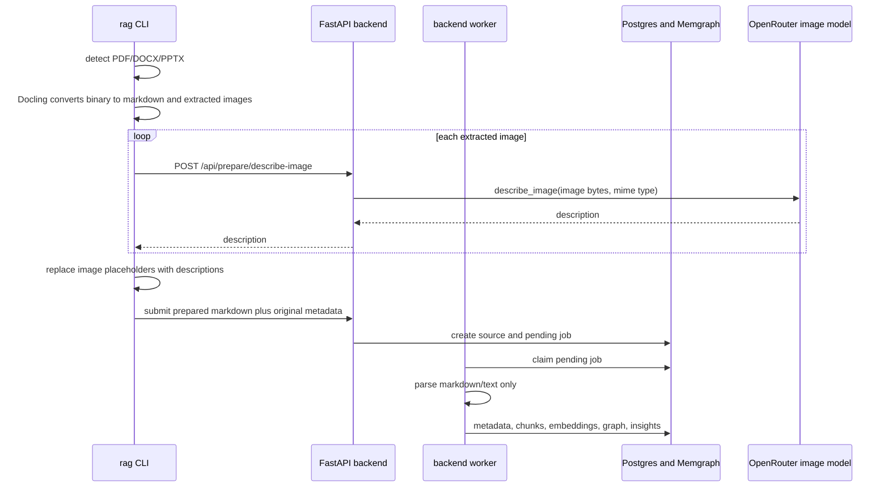
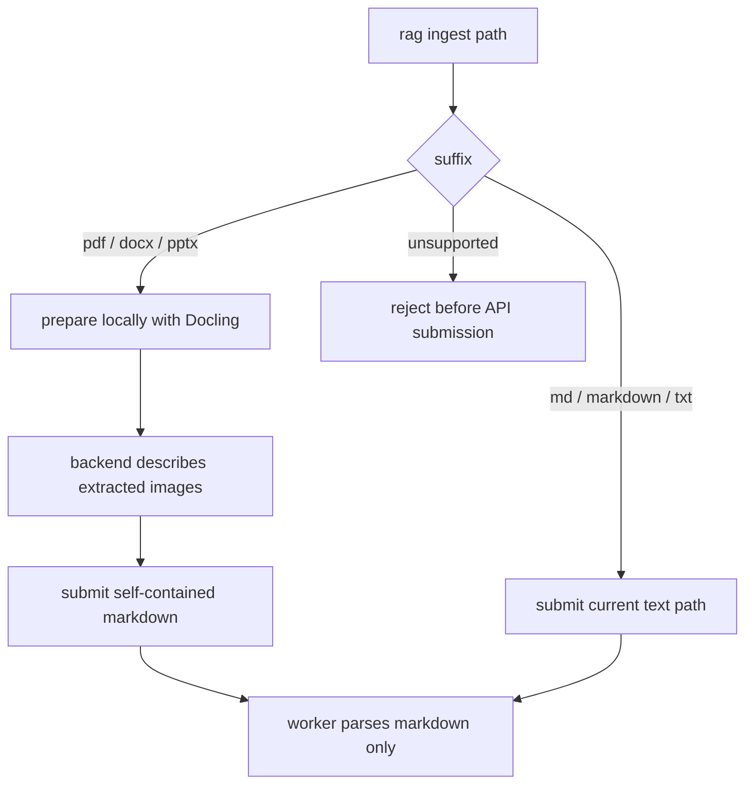

# Prepared Binary Ingestion - Plan

## Goal Capsule

| Field | Decision |
|---|---|
| Objective | Move PDF/DOCX/PPTX parsing out of the backend container while preserving `rag ingest` as the operator-facing command for all supported document types. |
| Product authority | The CLI should remain the ingestion entry point; the backend should remain the authority for API keys, image LLM calls, job records, worker execution, and stored corpus state. |
| Execution profile | Standard cross-surface refactor touching CLI behavior, API contracts, parser boundaries, packaging, Docker image contents, tests, and docs. |
| Stop conditions | Stop if preserving binary direct upload through `/api/ingest` becomes a hard requirement, if prepared markdown cannot preserve current image-description quality, or if removing Docling from the backend breaks a non-ingest runtime path. |
| Tail ownership | The implementing agent owns code, tests, README/AGENTS updates, and verification that the backend image no longer installs `.[ingest]`. |

---

## Product Contract

### Summary

`rag ingest` should accept PDF, DOCX, PPTX, MD, and TXT from the user's perspective, but binary document parsing should run on the CLI machine before the backend creates an ingestion job. The backend will expose an authenticated transient image-description endpoint so the CLI can finish prepared markdown without holding the OpenRouter key or making LLM calls directly. Workers will process markdown/text only, allowing the backend container to drop Docling and its Torch/CUDA dependency chain.

### Problem Frame

The backend image currently installs `.[ingest]` from `pyproject.toml`, which pulls in `docling>=2.0`. The backend needs that dependency only because worker subprocesses parse PDF/DOCX/PPTX inside the same container that serves the API. This makes rebuilds heavy and has already been called out in `docs/solutions/performance-issues/rag-retrieval-vector-prefilter-and-query-fanout.md` as an operational problem.

Current code confirms the split: `rag ingest` in API mode uploads the original file via `RagClient.submit_ingest`, `/api/ingest` calls `submit_ingestion_job`, and `execute_ingestion_pipeline` later calls `parse_document` inside the worker. `parse_document` bypasses Docling for markdown and text, but calls the lazy Docling converter for other suffixes.

### Requirements

**Operator experience**

- R1. `rag ingest` continues to accept `.pdf`, `.docx`, `.pptx`, `.md`, `.markdown`, and `.txt` paths in API mode.
- R2. For PDF/DOCX/PPTX in API mode, `rag ingest` prepares markdown locally before job submission and reports failures before a backend ingestion job is queued.
- R3. Operators do not need to expose `OPENROUTER_API_KEY` or image-captioning model configuration to the CLI machine.
- R4. `rag prepare` is available as an explicit command for generating prepared markdown without submitting an ingestion job.

**Backend and worker boundaries**

- R5. The backend container does not install Docling, Torch, or the `ingest` extra by default.
- R6. Backend workers process markdown/text inputs only and never call Docling for PDF/DOCX/PPTX during normal API-mode ingestion.
- R7. The backend owns image description through an authenticated ingest-scoped API that accepts transient base64 image payloads and returns text descriptions.
- R8. The existing downstream worker stages after parsing remain backend-owned: metadata extraction, profiling, chunking, validation, embeddings, graph extraction, graph linking, and insight extraction.

**Source semantics and compatibility**

- R9. Prepared binary ingestion stores the final self-contained markdown as the source content used by retrieval and source browsing.
- R10. Source metadata records the original filename, original extension, original content hash, prepared image count, and prepared markdown provenance.
- R11. Duplicate detection remains deterministic and should prefer the original binary hash for prepared binary submissions so repeated ingestion of the same PDF/DOCX/PPTX is rejected even if markdown formatting changes slightly.
- R12. Direct backend multipart upload of PDF/DOCX/PPTX is no longer part of the supported default path after this change; markdown/text upload remains supported.

### Acceptance Examples

- AE1. Given CLI API mode is configured, when an operator runs `rag ingest report.pdf`, then the CLI converts the document locally, asks the backend to describe embedded images, submits prepared markdown, and the resulting job starts from markdown parsing in the worker.
- AE2. Given a PDF contains three embedded figures, when the CLI prepares it, then the final submitted markdown contains three text descriptions and no unresolved Docling `<!-- image -->` placeholders.
- AE3. Given the backend container is rebuilt, when dependencies are installed, then `docling` is absent from the backend runtime environment and search/retrieve/community still import and run.
- AE4. Given an operator uploads `report.pdf` directly to `/api/ingest`, then the API rejects the binary extension with a clear unsupported-binary-ingest response rather than queuing a job that will fail in the worker.
- AE5. Given `rag prepare deck.pptx --out prepared.md`, when the command succeeds, then no job is created and the output markdown is suitable for `rag ingest prepared.md`.

### Scope Boundaries

In scope:

- Smart API-mode `rag ingest` for binary documents.
- Explicit `rag prepare` for local markdown preparation.
- Backend transient image description endpoint protected by the existing auth and `ingest` scope.
- API/client changes needed to submit prepared markdown and preserve original-source metadata.
- Packaging and Docker changes that remove Docling from the backend default install.
- Tests and docs covering the new CLI/API/worker contract.

Deferred to follow-up work:

- Durable storage or browsing of extracted image files as first-class source artifacts.
- Browser/frontend binary upload support.
- A separate heavy worker image that can parse binaries server-side.
- Batch retry/resume of a partially prepared document after some image descriptions have succeeded.
- Rich prepared-bundle upload with markdown plus assets.

Outside this plan:

- Changes to retrieval ranking, chunking strategy, graph extraction prompts, or insight extraction behavior.
- MCP ingestion tools; the MCP surface is intentionally read-only in current project guidance.

---

## Planning Contract

### Key Technical Decisions

- KTD1. Binary conversion moves to the CLI, not to a separate backend worker image. This directly removes Docling from the backend image and matches the user's current lack of web upload requirements.
- KTD2. Image descriptions remain backend-owned through a new transient API endpoint. The CLI extracts image bytes but does not call OpenRouter or read the server-side image model configuration.
- KTD3. Prepared markdown is self-contained. Extracted images are used only as inputs to image description and are discarded unless a later plan adds durable image asset storage.
- KTD4. The worker pipeline stays structurally intact. The parsing stage continues to normalize markdown/text into `sources.markdown_content`, while all later stages keep their existing ownership and retry semantics.
- KTD5. Backend binary multipart ingestion should be rejected by default after the migration. Keeping it would reintroduce either Docling in the backend or a predictable worker failure mode.
- KTD6. Original-source metadata travels with prepared submissions. The source row may store a markdown filename/file type, but metadata must preserve the original filename, extension, MD5, and prepared image count for operator traceability and duplicate checks.
- KTD7. Keep the heavy dependency optional and local. The base package remains server-safe; the prepare-capable install path carries Docling.

### High-Level Technical Design

### Assumptions

- The CLI environment can install a prepare extra that includes Docling, and operators who ingest binary documents are willing to use that install profile.
- Image descriptions are required for ingestion quality, but durable extracted image files are not required for source browsing in this plan.
- API mode is the primary deployment path for the container-size problem; direct-DB local mode should remain coherent but does not drive the architecture.
- The current `describe_image` implementation is safe to expose behind a narrow authenticated endpoint because it already performs a stateless OpenRouter request from server configuration.

### Existing Patterns to Preserve

- CLI commands should use `_use_api()` and `RagClient` in API mode, with direct-DB fallback only when there is a strong local-dev reason.
- `rag.cli` keeps heavy imports lazy and exposes patchable module-level wrappers for tests.
- API routes live under `src/rag/api/routes/`, are included through `src/rag/api/main.py`, and rely on the shared auth dependency plus `requires_scope` where a route needs a specific scope.
- CLI HTTP behavior is tested with `httpx.MockTransport` via `RagClient.with_transport`.
- Worker lifecycle remains owned by `WorkerSupervisor`; do not bypass the supervisor or mutate worker rows outside it.

### System-Wide Impact

- Packaging changes affect the backend image, local developer installs, and any environment that currently assumes `pip install -e .[ingest]` is the server install command.
- API behavior changes for PDF/DOCX/PPTX multipart uploads; this is acceptable because there is no web upload requirement, but tests and docs must make the rejection clear.
- Duplicate detection and source metadata semantics shift for prepared binary ingestion; implementers must avoid silently losing original-file provenance.
- Retry behavior remains server-side from the queued markdown job. Re-running local preparation is a CLI concern before a job exists, not a worker retry concern.

### Risks and Mitigations

| Risk | Mitigation |
|---|---|
| Prepared markdown loses image information if placeholder replacement mismatches Docling output. | Add parser/prepare tests with multiple images and assert no `<!-- image -->` placeholders remain. |
| Duplicate detection changes from original binary hash to markdown hash. | Add an ingestion submission path that accepts original hash metadata and checks it before inserting a source. |
| Backend still imports Docling through `rag.parser` or test imports. | Preserve lazy imports, add tests that importing API/CLI/search paths does not import Docling, and verify backend dependencies install base package only. |
| Direct-DB mode becomes inconsistent with API mode. | Define direct-DB behavior explicitly: either prepare locally then submit markdown to local DB path, or fail with a clear instruction to install/use API mode. |
| The image-description endpoint becomes an unbounded proxy to the LLM. | Require `ingest` scope, validate MIME type, cap request size, and return clear 4xx errors for invalid payloads. |

---

## Implementation Units

### U1. Extract Preparation Logic into a CLI-Safe Module

- **Goal:** Create a preparation layer that converts PDF/DOCX/PPTX into self-contained markdown inputs without requiring the backend worker to parse binaries.
- **Requirements:** R1, R2, R4, R6, R9, AE1, AE2, AE5.
- **Dependencies:** None.
- **Files:** `src/rag/parser.py`, `src/rag/prepare.py`, `tests/test_prepare.py`, `tests/test_parser.py`.
- **Approach:** Move or wrap the Docling conversion behavior behind a new prepare-focused module that returns markdown, element-tree metadata if useful, image payloads, placeholder positions, original hash, and preparation metadata. Keep markdown/text parsing behavior in `parser.py` lightweight and Docling-free. The prepare module may import Docling lazily and should raise a clear error when the prepare extra is missing.
- **Patterns to follow:** Current `_get_docling_converter`, `_describe_docling_pictures`, and `parse_document` behavior in `src/rag/parser.py`; existing import-safety test in `tests/test_cli_imports.py`.
- **Test scenarios:** 
  - Given a markdown file, preparing it should not import Docling and should return text unchanged except for existing markdown image handling if that behavior is intentionally shared.
  - Given a PDF/DOCX/PPTX fixture, preparation should return non-empty markdown and a source metadata payload containing original filename, original extension, original MD5, and image count.
  - Given Docling is unavailable, preparing a binary file should raise a clear prepare-specific error that the CLI can present.
  - Covers AE2. Given Docling markdown contains multiple `<!-- image -->` placeholders and matching extracted images, placeholder replacement should consume descriptions in order and leave no unresolved placeholders.
- **Verification:** Unit coverage proves conversion output shape, import safety, and placeholder replacement without requiring backend job execution.

### U2. Add Backend Image Description API

- **Goal:** Let the CLI ask the backend to describe extracted images without giving the CLI LLM credentials.
- **Requirements:** R3, R7, AE1, AE2.
- **Dependencies:** None.
- **Files:** `src/rag/api/routes/prepare.py`, `src/rag/api/main.py`, `src/rag/api/schemas.py`, `src/rag/image_description.py`, `tests/test_api_prepare.py`, `tests/test_api_gating.py`, `tests/test_image_description.py`.
- **Approach:** Add an authenticated route such as `POST /api/prepare/describe-image` that accepts a supported MIME type and base64 image content, decodes it, calls `describe_image`, and returns a description. Reuse server-side settings and request code from `src/rag/image_description.py`. Enforce `ingest` scope, supported MIME types, and a conservative payload size limit before making an LLM call.
- **Patterns to follow:** `src/rag/api/routes/ingest.py` request/response schema style; shared auth inclusion in `src/rag/api/main.py`; existing `describe_image` tests.
- **Test scenarios:** 
  - Given a valid base64 PNG and an `ingest` principal, the endpoint calls `describe_image` with decoded bytes and returns the description.
  - Given malformed base64, unsupported MIME type, or oversized payload, the endpoint returns a 4xx error and does not call `describe_image`.
  - Given a principal without `ingest` scope, the endpoint is rejected by the existing auth/scope gates.
  - Given `describe_image` raises an upstream error, the endpoint returns a clear server error without leaking secrets.
- **Verification:** API tests cover request validation, auth/scope gating, and integration with the existing image-description helper.

### U3. Extend RagClient for Prepared Markdown and Image Description

- **Goal:** Give CLI commands one HTTP client surface for image descriptions and prepared markdown job submission.
- **Requirements:** R2, R3, R7, R9, R10, AE1.
- **Dependencies:** U2.
- **Files:** `src/rag/api_client.py`, `tests/test_api_client.py`.
- **Approach:** Add client methods for transient image description and text/markdown ingestion. The text submission method should use `/api/ingest/text` or an equivalent prepared-markdown endpoint and pass metadata that preserves original-source fields. Keep existing `submit_ingest` for markdown/text multipart where useful, but route prepared binary ingestion through the new methods.
- **Patterns to follow:** Existing `RagClient.submit_ingest`, `_post_json`, and `with_transport` test patterns.
- **Test scenarios:** 
  - Given image bytes and MIME type, the client sends base64 JSON to the backend route and returns the description.
  - Given markdown content, name, and metadata, the client posts to the text ingestion endpoint and returns the queued job response.
  - Given backend 4xx/5xx responses, the client raises `ApiError` with the returned detail.
  - Given metadata includes original binary hash and file type, the serialized request preserves those fields.
- **Verification:** MockTransport tests prove request paths, JSON shape, error handling, and metadata preservation.

### U4. Make `rag ingest` Smart for Binary Inputs

- **Goal:** Preserve the operator-facing `rag ingest` command while moving binary parsing to the CLI in API mode.
- **Requirements:** R1, R2, R3, R9, R10, R11, AE1, AE2.
- **Dependencies:** U1, U3.
- **Files:** `src/rag/cli.py`, `tests/test_cli_ingest.py`, `tests/test_cli_api_mode.py`.
- **Approach:** In API mode, branch on file suffix. Markdown/text continue through existing submission behavior unless a prepared text path is cleaner. PDF/DOCX/PPTX call the prepare module locally, ask the backend for image descriptions, replace placeholders, then submit self-contained markdown with original-source metadata. Folder ingestion should apply the same per-file logic. Error output should distinguish local preparation failure from backend submission failure.
- **Execution note:** Add characterization tests for current markdown/text API-mode behavior before changing binary branching.
- **Patterns to follow:** Existing `ingest` function structure, `_parse_key_value_pairs`, API-mode tests in `tests/test_cli_api_mode.py`, and table output in `tests/test_cli_ingest.py`.
- **Test scenarios:** 
  - Given API mode and an `.md` file, `rag ingest` still calls the normal markdown submission path and reports a pending job.
  - Given API mode and a `.pdf` file, `rag ingest` calls preparation, calls backend image description for extracted images, submits markdown content, and reports the returned job.
  - Given a folder containing mixed supported files, markdown/text and binary files each use the correct path and `--name` remains ignored.
  - Given preparation fails before submission, no backend job submission call is made and the CLI exits non-zero with a useful error.
  - Given image description fails for one extracted image, no ingestion job is queued and the failure identifies the source file.
- **Verification:** CLI tests prove smart routing, failure boundaries, and output behavior without requiring live Docling or network calls.

### U5. Add Explicit `rag prepare`

- **Goal:** Provide a non-submitting way to produce prepared markdown from binary documents.
- **Requirements:** R4, R9, AE5.
- **Dependencies:** U1, optionally U3 when using server-side image descriptions.
- **Files:** `src/rag/cli.py`, `src/rag/prepare.py`, `tests/test_cli_prepare.py`, `README.md`.
- **Approach:** Add `rag prepare PATH --out OUTPUT` for PDF/DOCX/PPTX. The command should prepare markdown and write it to the requested file. Because image descriptions are backend-owned, the command should require API configuration when extracted images need description, unless an explicit no-caption mode is introduced and clearly marked as lower quality. The output markdown should be ingestible with `rag ingest prepared.md`.
- **Patterns to follow:** Typer command style in `src/rag/cli.py`; API config detection through `_use_api()` and `RagClient.from_config`.
- **Test scenarios:** 
  - Given a binary document and configured API client, `rag prepare` writes markdown containing backend-returned image descriptions.
  - Given `--out` points to an existing file, the command follows the chosen overwrite behavior and tests that behavior.
  - Given no API config and the document contains images, the command fails clearly rather than making local LLM calls.
  - Given a binary document with no extracted images, the command writes markdown without calling the image-description endpoint.
- **Verification:** CLI tests cover output file creation, API dependency for image descriptions, and no-job semantics.

### U6. Change Backend Ingest Contracts and Duplicate Semantics

- **Goal:** Ensure the backend queues markdown/text jobs and rejects unsupported binary uploads in the default server image.
- **Requirements:** R5, R6, R9, R10, R11, R12, AE3, AE4.
- **Dependencies:** U3.
- **Files:** `src/rag/api/routes/ingest.py`, `src/rag/ingestion.py`, `src/rag/storage.py`, `src/rag/api/schemas.py`, `tests/test_api_ingest.py`, `tests/test_ingestion_submit.py`, `tests/test_storage.py`.
- **Approach:** Narrow `/api/ingest` accepted multipart extensions to markdown/text by default, while keeping `/api/ingest/text` or a prepared-markdown equivalent as the smart-ingest target. Extend submission internals only as needed to preserve original-source metadata and duplicate detection by original binary hash. Avoid schema migration unless existing JSON metadata is sufficient; if a unique constraint or new column is needed for original hashes, document and test the migration.
- **Patterns to follow:** Existing `submit_ingestion_job`, `check_duplicate`, `store_file`, and API duplicate error mapping.
- **Test scenarios:** 
  - Given `.pdf`, `.docx`, or `.pptx` multipart upload to `/api/ingest`, the API returns an unsupported binary-ingest error and does not call `submit_ingestion_job`.
  - Given markdown text submission with original metadata, the source row stores markdown content flow metadata and queues a pending job.
  - Given an existing active source with the same original binary hash, prepared submission is rejected as duplicate.
  - Given a deleted source with the same hash, prepared submission follows existing deleted-source duplicate semantics.
  - Given markdown local image references in API mode, behavior is documented and tests reflect whether asset copying is supported or intentionally absent.
- **Verification:** API and ingestion-submit tests prove binary rejection, prepared markdown acceptance, provenance metadata, and duplicate behavior.

### U7. Keep Worker and Parser Backend-Safe

- **Goal:** Make the backend worker operate without Docling installed and fail clearly if a binary source somehow reaches parsing.
- **Requirements:** R5, R6, R8, AE3, AE4.
- **Dependencies:** U1, U6.
- **Files:** `src/rag/parser.py`, `src/rag/worker.py`, `src/rag/ingestion.py`, `tests/test_parser.py`, `tests/test_worker.py`, `tests/test_job_lifecycle.py`, `tests/test_cli_imports.py`.
- **Approach:** Keep `parse_document` for markdown/text lightweight. Decide whether binary parsing support remains only in the prepare module or stays in parser behind a prepare-only import path; either way, backend worker tests should prove normal worker execution does not require Docling. Add a clear parse error for unsupported binary suffixes if they appear in stored sources after the API contract change.
- **Patterns to follow:** Existing `test_parse_document_does_not_require_docling_for_markdown`, `test_parse_document_raises_clear_error_for_binary_formats_without_docling`, and worker job lifecycle tests.
- **Test scenarios:** 
  - Importing `rag.parser` and `rag.cli` does not import Docling.
  - Parsing markdown/text without Docling installed succeeds.
  - Parsing a binary path in backend-safe mode raises a clear unsupported-binary error.
  - Worker execution for a prepared markdown source completes the parsing stage and continues to later stages with existing mocks.
  - Retry from a post-parsing stage continues to use `sources.markdown_content`.
- **Verification:** Parser/import/worker tests prove backend-safe operation and retry compatibility.

### U8. Remove Docling from Backend Packaging and Update Docs

- **Goal:** Make the backend container install only server-safe dependencies and document the new prepared ingestion contract.
- **Requirements:** R5, R12, AE3.
- **Dependencies:** U1, U6, U7.
- **Files:** `pyproject.toml`, `Dockerfile`, `README.md`, `AGENTS.md`, `.env.example`, `tests/test_cli_imports.py`.
- **Approach:** Keep Docling in an optional prepare/install extra and remove `.[ingest]` from the backend Docker install. Consider renaming extras so `prepare` is the heavy local capability and base install is the server/API capability. Update docs to explain that binary ingestion happens through CLI preparation, image descriptions are server-side API calls, backend workers handle markdown only, and direct PDF/DOCX/PPTX API upload is unsupported by default.
- **Patterns to follow:** Current packaging note in `README.md` and `AGENTS.md`; Dockerfile dependency layer concern in `docs/solutions/performance-issues/rag-retrieval-vector-prefilter-and-query-fanout.md`.
- **Test scenarios:** 
  - A base install imports API, CLI, search, retrieve, and worker modules without Docling.
  - The Dockerfile installs the base package rather than `.[ingest]`.
  - Documentation names the prepare-capable install path for operators who ingest PDFs, DOCX, or PPTX.
  - README ingestion examples show smart `rag ingest` and explicit `rag prepare`.
- **Verification:** Static checks and import tests prove backend packaging no longer depends on Docling; docs reflect the new operator workflow.

---

## Verification Contract

| Area | Command | Done Signal |
|---|---|---|
| CLI API path | `pytest -q tests/test_cli_api_mode.py tests/test_api_client.py tests/test_cli_ingest.py tests/test_cli_prepare.py` | Smart binary routing, prepared markdown submission, and explicit prepare command are covered. |
| API ingest and prepare routes | `pytest -q tests/test_api_ingest.py tests/test_api_prepare.py tests/test_api_gating.py tests/test_image_description.py` | Binary upload rejection, image description endpoint, and auth/scope behavior are covered. |
| Parser, worker, storage | `pytest -q tests/test_parser.py tests/test_worker.py tests/test_job_lifecycle.py tests/test_ingestion_submit.py tests/test_storage.py tests/test_cli_imports.py` | Backend-safe parser behavior, worker retry behavior, duplicate/provenance handling, and import safety are covered. |
| Full ingestion-focused suite | `pytest -q tests/test_cli_jobs.py tests/test_job_lifecycle.py tests/test_worker.py tests/test_ingestion_submit.py tests/test_parser.py tests/test_storage.py tests/test_cli_ingest.py tests/test_chunking.py tests/test_observability.py tests/test_cli_health.py tests/test_profiling.py tests/test_chunk_validation.py tests/test_embedding.py` | Existing ingestion behavior remains stable after contract changes. |
| Container dependency proof | Build or inspect the backend image dependency install result and verify `import docling` fails in the backend runtime while API health still works. | Backend image no longer carries Docling/Torch/CUDA stack. |
| Live smoke, when Docker is available | Start the stack, configure CLI API mode, ingest a prepared markdown file, launch a worker, and confirm the job completes. | End-to-end markdown ingestion still works against the live backend. |

---

## Definition of Done

- `rag ingest` in API mode accepts binary documents by preparing them locally and submitting markdown, not by uploading the binary for worker-side parsing.
- `rag prepare` can create markdown from PDF/DOCX/PPTX without creating a job.
- The backend exposes an authenticated transient image-description API and the CLI uses it for extracted image captions.
- Backend multipart ingest rejects PDF/DOCX/PPTX by default with a clear message.
- Backend workers complete prepared markdown jobs without Docling installed.
- Original-source provenance and duplicate detection for prepared binary ingestion are preserved through metadata or a tested schema extension.
- The backend Dockerfile no longer installs `.[ingest]` or any Docling-dependent extra.
- README and AGENTS explain the new CLI/backend/worker responsibility split and the prepare-capable install path.
- All planned tests pass, and abandoned experimental paths are removed from the final diff.

---

## Sources and Research

- `src/rag/cli.py` currently routes `rag ingest` through `RagClient.submit_ingest` in API mode and direct `submit_ingestion_job` otherwise.
- `src/rag/api_client.py` currently exposes multipart ingest but not `/api/ingest/text`.
- `src/rag/api/routes/ingest.py` currently accepts PDF/DOCX/PPTX/MD/TXT multipart uploads and has a JSON text endpoint.
- `src/rag/ingestion.py` stores original files, queues jobs, and runs parsing plus all downstream worker stages.
- `src/rag/parser.py` bypasses Docling for markdown/text and calls Docling for other suffixes.
- `src/rag/image_description.py` performs server-configured OpenRouter image description without Docling.
- `Dockerfile` currently installs `pip install --no-cache-dir --prefix=/install -e .[ingest]`.
- `pyproject.toml` currently defines `ingest = ["docling>=2.0"]`.
- `docs/solutions/performance-issues/rag-retrieval-vector-prefilter-and-query-fanout.md` records that full Docker rebuilds were avoided because the current Dockerfile redownloads the heavy ingest/Torch dependency stack.
