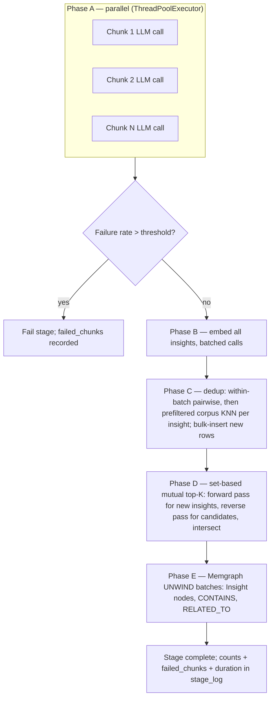

# Intake Pipeline 90-Second Target - Plan

## Goal Capsule

| Field | Decision |
|---|---|
| Objective | Bring full intake processing (chunks, entities, insights, related-insight edges) for a typical source to ≤90 seconds, make per-source cost independent of corpus size, add a stage-timing guardrail so regressions surface, and ship a weekly corpus-maintenance script. |
| Product authority | Decisions confirmed in the 2026-07-03 brainstorm session: everything-done-in-90s (no deferred insight phase), approximate vector search acceptable for dedup and linking, typical-source target with proportional scaling for large sources, three deliverables (pipeline rework, guardrail, maintenance script). |
| Execution profile | Deep cross-cutting perf refactor touching the insight storage path, graph extraction, pipeline stage registry, job telemetry, CLI, and a new maintenance script. No API surface or frontend changes. |
| Stop conditions | Stop and surface if: preserving mutual-top-K `RELATED_TO` semantics under the set-based rewrite proves impossible without exact scans; the binary prefilter misses duplicates at a rate that visibly degrades the graph in testing; or removing the `graph_linking` stage breaks queued/retried jobs in a way compatibility handling cannot cover. |
| Tail ownership | The implementing agent owns code, tests, README/AGENTS updates, and a live-stack measurement demonstrating the 90s target on a real source before declaring done. |

---

## Product Contract

### Summary

Intake currently takes ~86 minutes (median, last week) for work that took ~55 seconds in late April. The cause is measured and verified: for every new insight, intake runs full-precision KNN scans over the entire 108k-row `insights` table (~9.8s per scan, up to K+2 scans per insight), because no index can serve raw 4096-dim `<=>` ordering. The fix applies the repo's existing binary-quantized HNSW prefilter + full-precision rerank pattern to intake, restructures insight storage from per-insight loops into set-based batch passes, parallelizes entity extraction, and adds two safety nets: a stage-timing guardrail and a weekly maintenance script that merges duplicates and keeps indexes healthy.

### Problem Frame

Measured on the live database (2026-07-03):

- Median intake processing time grew from ~55s (week of 2026-04-27) to ~5,172s (week of 2026-06-29), tracking corpus growth. Corpus: 108,841 insights, 125,979 chunks, 113,878 entities, 7,524 sources.
- Stage breakdown (last 14 days): `insight_extraction` averages 7,301s; entity extraction (recorded under the `graph_extraction`/`graph_linking` timestamps) averages ~173s; every other stage is single-digit seconds.
- `upsert_insight` (`src/rag/insight_extraction.py:71-92`) orders by raw `embedding <=>`, which cannot use `insights_embedding_binary_hnsw_idx` (an expression index over `binary_quantize(embedding)::bit(4096)`). `EXPLAIN ANALYZE` on the live DB shows a parallel sequential scan at 9,830ms.
- `link_related_insights` (`src/rag/insight_extraction.py:127-191`) issues one forward KNN plus up to `INSIGHT_LINK_TOP_K` (default 10) reverse KNN queries per new insight — each a full scan.
- Insight storage is fully serial per chunk/insight; only extraction LLM calls run in a thread pool (`INSIGHT_EXTRACTION_CONCURRENCY`, env-set to 5).
- Per-chunk extraction failures are swallowed: `extract_insights_from_chunk` catches all exceptions and returns `[]` with only a log warning — silent insight loss with no job-level record.
- `graph_linking` is a no-op compatibility stub (`src/rag/graph_linking.py`); entity extraction in `graph_extraction.py:208` loops chunks serially, making one entity-extraction LLM call plus one embeddings call per chunk (`extract_relationships` exists but is dead code — never invoked; `relationships=[]` is passed downstream today).
- Retrieval already solved the same 4096-dim problem with a binary prefilter + rerank (`src/rag/retrieval.py:394-412`, `scripts/migrate/009_binary_vector_prefilter_indexes.sql`, documented in `docs/solutions/performance-issues/rag-retrieval-vector-prefilter-and-query-fanout.md`). Intake never received that treatment.

### Requirements

**Performance**

- R1. A typical source (median ~12 chunks) completes the full intake pipeline — parsing through insight linking — in ≤90 seconds of processing time (queue wait excluded).
- R2. No intake stage performs a query whose cost grows with total corpus size; all insight KNN lookups go through the binary prefilter + full-precision rerank pattern.
- R3. Large sources scale roughly linearly with chunk count; a p90 source (~35 chunks) is expected to land in low single-digit minutes.

**Fidelity**

- R4. Insight dedup and `RELATED_TO` linking may use approximate (prefiltered) nearest-neighbor search; mutual-top-K semantics and the same-source exclusion rules are preserved over the prefiltered candidate pool.
- R5. Insights extracted within the same source batch dedup against each other, not only against the existing corpus.
- R6. Entity exact-name dedup (SELECT-first on `canonical_name`) is unchanged.

**Audit and recovery**

- R7. Per-chunk extraction LLM failures are recorded in the job's `stage_log` (list of failed chunk ids per stage); the stage completes with warnings below a configurable failure-rate threshold and fails above it. No silent insight loss.
- R8. Each completed stage records its duration in `stage_log` in a directly queryable form.
- R9. Every redesigned stage remains idempotent under the existing `retry_from_stage` + `cleanup_from_stage` recovery path; a retry after a mid-stage crash cannot double-write rows or edges.
- R9b. `insight_extraction` cleanup covers a crash mid-Phase-E: it deletes source-scoped Memgraph `Insight` nodes whose `insight_id` no longer exists in Postgres, not only Memgraph-local orphans (`CONTAINS`-less nodes) as `_cleanup_orphan_insights` does today.

**Guardrail**

- R10. A `rag jobs stats` CLI command reports per-stage duration percentiles (at least p50/p90) over a selectable time window, computed from `stage_log`.
- R11. The worker emits a log warning when a stage's recent median duration exceeds a configurable multiple of a *pinned* baseline (recorded at deploy time or via an explicit `--set-baseline` command), not a rolling/moving median — a moving baseline drifts upward with a gradual corpus-coupled regression and would never fire for the failure class this guardrail exists to catch (this is exactly what happened April→June before this plan).

**Weekly maintenance**

- R12. A standalone script runs the full maintenance sweep with `--dry-run` (default) and `--execute` modes, printing per-phase counts: entity duplicate merge, insight duplicate merge, orphan/consistency sweep, index and stats health.
- R13. Insight duplicate merge re-points `chunk_insights` rows and Memgraph `CONTAINS`/`RELATED_TO` edges to the surviving insight before deleting duplicates; no dangling references in either store.

**Pipeline hygiene and docs**

- R14. The no-op `graph_linking` stage is removed from the pipeline without breaking jobs already queued or retried with that stage recorded.
- R15. README and AGENTS.md reflect the new stage behavior, config knobs, stats command, and maintenance script.

### Success Criteria

- Live-stack measurement: ingest a real ~12-chunk source end to end; job `stage_log` shows total processing ≤90s.
- `EXPLAIN ANALYZE` on the rewritten dedup and linking queries shows index-assisted prefilter (no `Seq Scan` on `insights` in the hot path); per-query time drops from ~9,800ms to low tens of milliseconds.
- `rag jobs stats` returns per-stage p50/p90 for a chosen window against the live database.
- Maintenance script dry-run on the live corpus completes and reports plausible counts without writing.

### Scope Boundaries

- **Not in scope:** deferring insight work to an async post-searchable phase (rejected in brainstorm — everything completes in-pipeline); multi-worker scaling or queue-throughput work; changing embedding model or dimensions; re-extracting insights for historical sources; frontend changes; MCP surface changes.
- **Deferred to follow-up work:** cross-stage parallelism (running entity and insight extraction concurrently) — revisit only if live measurements miss the 90s target; surfacing guardrail stats in the frontend.

### Dependencies / Assumptions

- `insights_embedding_binary_hnsw_idx` exists on live databases (migration 009 applied). The maintenance script and rewritten queries depend on it.
- OpenCode (insight extraction) and OpenRouter (entity extraction, embeddings) tolerate the raised concurrency. Assumed yes at ~12 concurrent calls; if rate limits bite, the env knobs cap it back down — the target then depends on per-call latency, which should be re-measured.
- Per-call extraction latency of roughly 10–30s. The A-phase budgets in the Planning Contract derive from this; first implementation step for U3 verifies it empirically.

### Acceptance Examples

- AE1. **Given** a 12-chunk markdown source and a warm stack, **when** `rag ingest` runs it through a worker, **then** the job completes with all stages `completed` and the span from first to last stage `completed_at` is ≤90 seconds.
- AE2. **Given** two near-identical insights extracted from two chunks of the same source in one batch, **when** the storage pass runs, **then** exactly one `insights` row exists and both chunks link to it via `chunk_insights`.
- AE3. **Given** an insight-extraction batch where 2 of 12 chunk LLM calls fail and the failure threshold is 25%, **when** the stage finishes, **then** the stage is `completed`, `stage_log.insight_extraction.output.failed_chunks` lists the two chunk ids, and the remaining 10 chunks' insights are stored.
- AE4. **Given** a job that failed mid-way through `insight_extraction`, **when** `rag jobs retry` re-runs it from that stage, **then** the completed job has no duplicate `insights` rows, `chunk_insights` links, or Memgraph edges for that source.
- AE4b. **Given** a job that crashed mid-Phase-E (after some `Insight`/`CONTAINS` Memgraph writes but before the stage completed), **when** `rag jobs retry` re-runs it from `insight_extraction`, **then** cleanup removes source-scoped Memgraph `Insight` nodes whose id no longer exists in Postgres before re-extraction, and the completed job has no duplicate or orphaned Memgraph nodes/edges for that source.
- AE5. **Given** a corpus containing two insights with cosine similarity above the merge threshold, **when** the maintenance script runs with `--execute`, **then** one row remains, all `chunk_insights` rows point at it, and Memgraph has no `Insight` node for the deleted id.

---

## Planning Contract

### Key Technical Decisions

- KTD1. **Binary prefilter + full-precision rerank for every intake insight KNN.** Mirror `dense_retrieve` (`src/rag/retrieval.py:394-412`): a `MATERIALIZED` CTE ordering by `binary_quantize(embedding)::bit(4096) <~> binary_quantize(%s::vector)::bit(4096)` with a candidate `LIMIT`, then rerank candidates with `embedding <=>`. Set `hnsw.ef_search` to the candidate count before the query (see `_set_hnsw_ef_search` in `src/rag/retrieval.py`) — pgvector silently caps HNSW results at `ef_search` regardless of SQL `LIMIT`. Rationale: proven in-repo pattern, same index, converts 9.8s scans to milliseconds.
- KTD2. **Over-fetch candidates before post-filters.** The linking queries exclude same-source insights via `NOT EXISTS` joins. Apply those filters to the reranked candidate pool, and fetch 3–5× the needed K in the prefilter so filtering doesn't starve results. Candidate count is a config knob, not a literal.
- KTD3. **Set-based mutual top-K, not per-neighbor loops.** Compute forward top-K for all new insights of a source in one pass (`JOIN LATERAL` over the new insight set, or one prefiltered query per insight — both acceptable since each is milliseconds), then compute the reverse top-K for the distinct candidate set the same way, and intersect in Python to find mutual pairs. This replaces the current 1 + K sequential scans per insight and preserves R4 semantics.
- KTD4. **Threads for LLM calls only; batches for everything else.** Extraction fan-out uses `ThreadPoolExecutor` (existing pattern in `_extract_chunk_insights_parallel`). Embeddings, Postgres writes, and Memgraph writes get fast through batching (`get_embeddings` already batches 32; multi-row inserts; `UNWIND` in Memgraph — precedent at `src/rag/community.py:129` and `src/rag/retrieval.py:1121`). Threading DB writes would add failure modes for no gain once batching lands.
- KTD5. **Stage model unchanged.** Stages stay sequential top-level units so `stage_log`, `retry_from_stage`, and `cleanup_from_stage` (`src/rag/ingestion.py`) keep working untouched. Parallelism lives inside stages.
- KTD6. **Failure policy is record-and-continue with a threshold.** Per-chunk LLM failures append to a `failed_chunks` list in the stage output; stage fails only when `len(failed_chunks) / total_chunks` exceeds a config threshold (default 0.25). Rationale: one flaky LLM call shouldn't fail a 90s job, but systematic failure shouldn't masquerade as success. This threshold is a **single shared config knob** (suggested `STAGE_FAILURE_RATE_THRESHOLD`, default 0.25) used by both `insight_extraction` (U3) and `graph_extraction` (U4) — not two independently-named knobs — since U3 and U4 land in parallel and must not invent divergent config surfaces for the same policy.
- KTD6b. **Missing LLM API key short-circuits before fan-out, not through the failure gate.** Today an unset `OPENCODE_API_KEY` yields a graceful zero-insight ingest (used in dev/CI/smoke runs). Under the record-and-continue policy this would otherwise read as a 100% per-chunk failure rate and either fail every unconfigured ingest or silently rely on undocumented threshold math. Both `insight_extraction` (U3) and `graph_extraction` (U4) must detect a missing key before starting the extraction fan-out and record an explicit skip marker in the stage output; the failure-rate threshold applies only to calls that were actually attempted.
- KTD7. **Maintenance is a standalone script, not a worker job.** Follows the established `scripts/` pattern (`merge_semantic_duplicates.py`: argparse, `--dry-run`/`--execute`, prints counts, calls `vacuum_analyze_entities()`). Entity merging is reused by invoking that script's logic, not reimplemented.
- KTD8. **`graph_linking` removal with registry compatibility.** Remove the stage from `STAGE_ORDER` and delete `src/rag/graph_linking.py`, but make stage-name lookups (`retry_from_stage` validation, `cleanup_from_stage`, stage-log rendering) tolerate the name appearing in old jobs' `stage_log` or `retry_from_stage` fields. A retry that names `graph_linking` maps to the nearest surviving downstream stage (`insight_extraction`).

### High-Level Technical Design

Redesigned `insight_extraction` stage — phases inside one stage:

Per-stage time budget for a median (12-chunk) source, against current measured figures. **Note on sources:** per-stage rows are 14-day averages; the Total row's "current" figure is the week-of-06-29 *median* (the two are different statistics measured over different windows — do not compare them stage-by-stage as if they were the same metric).

| Stage | Current (measured) | Target | Mechanism |
|---|---|---|---|
| parsing–validation | ~10s (14-day avg) | ~10s | unchanged |
| embedding | ~9s (14-day avg) | ~5–10s | unchanged |
| graph_extraction | ~173s (14-day avg) | ~20–30s | parallel LLM calls, batched writes (U4) |
| graph_linking | ~0s (no-op, 14-day avg) | removed | U5 |
| insight_extraction | ~7,301s (14-day avg) | ~35–45s | U1–U3 |
| **Total** | **~86 min (week-of-06-29 median)** | **~70–90s** | |

### Sequencing

U1 → U2 → U3 form the core path and land in that order (each builds on the previous). U4, U5, U6 are independent of the core path and of each other. U7 depends on U1 (reuses the prefiltered dedup query shape). U8 is last.

---

## Implementation Units

### U1. Prefiltered insight dedup

**Goal:** `upsert_insight` stops scanning the corpus; dedup becomes an index-assisted prefilter + rerank lookup.

**Requirements:** R2, R4. Advances R1.

**Dependencies:** none.

**Files:** `src/rag/insight_extraction.py`, `src/rag/config.py`, `.env.example`, `tests/test_insight_extraction.py`, `tests/test_config.py`.

**Approach:** Rewrite the SELECT in `upsert_insight` per KTD1: prefilter CTE over `insights_embedding_binary_hnsw_idx`, rerank with `embedding <=>`, `LIMIT 1`. Add a config knob for the prefilter candidate count (suggested `INSIGHT_PREFILTER_CANDIDATES`, default ~100 — name is directional). Set `hnsw.ef_search` to the candidate count before the query; either import the ef-search helper from `retrieval.py` or move it to a shared location (`src/rag/db.py` is the natural home) — implementer's choice, but do not duplicate the SQL string. Threshold comparison against `INSIGHT_DEDUP_COSINE_THRESHOLD` is unchanged.

**Patterns to follow:** `dense_retrieve` prefilter CTE (`src/rag/retrieval.py:394-412`); `_set_hnsw_ef_search` (`src/rag/retrieval.py`); the `bit(4096)` explicit cast (its omission broke index creation once — see `docs/solutions/performance-issues/rag-retrieval-vector-prefilter-and-query-fanout.md`).

**Test scenarios:**
- Happy path: embedding similar to an existing insight above threshold → returns existing id, `is_new=False`, no INSERT issued.
- Happy path: embedding below threshold → INSERT issued, new id returned, `is_new=True`.
- Edge: empty `insights` table → INSERT path, no error from the prefilter CTE.
- Edge: prefilter returns candidates but all fall below threshold after full-precision rerank → new insight created.
- Config: `INSIGHT_PREFILTER_CANDIDATES` has a default and is overridable from env (mirror existing `INSIGHT_*` tests in `tests/test_config.py`).

**Verification:** unit tests green; on the live stack, `EXPLAIN ANALYZE` of the new query shows the HNSW index scan in the prefilter and execution time in low tens of milliseconds.

### U2. Set-based RELATED_TO linking

**Goal:** replace `link_related_insights`'s per-insight, per-neighbor scan loop with a set-based mutual top-K pass for a whole source batch, writing edges via `UNWIND`.

**Requirements:** R2, R4. Advances R1.

**Dependencies:** U1 (shared prefilter query shape and ef-search helper).

**Files:** `src/rag/insight_extraction.py`, `tests/test_insight_extraction.py`.

**Approach:** New function that takes the source id and the batch of newly inserted insights (ids + embeddings) and computes `RELATED_TO` pairs per KTD3: forward top-K per new insight over prefiltered candidates with the existing same-source `NOT EXISTS` exclusion applied post-rerank (over-fetch per KTD2); reverse top-K for the distinct forward candidates with the existing shared-source exclusion semantics; intersect to get mutual pairs with their similarities. Write all edges for the batch in one Memgraph `UNWIND` statement (bidirectional MERGE as today, `src/rag/insight_extraction.py:182-191` semantics). `INSIGHT_LINK_TOP_K` keeps its meaning.

**Technical design (directional):** forward pass as one query using `JOIN LATERAL` over a `VALUES`/`unnest` list of new insight ids, or one prefiltered query per insight in a loop — both are acceptable at millisecond query cost; pick whichever keeps the exclusion subqueries readable.

**Patterns to follow:** `UNWIND` batch writes (`src/rag/community.py:129`, `src/rag/retrieval.py:1121`); existing exclusion subqueries in `link_related_insights` (`src/rag/insight_extraction.py:140-146, 164-172`) define the semantics to preserve.

**Test scenarios:**
- Happy path: two insights mutually in each other's top-K, different sources → one bidirectional `RELATED_TO` pair written with the forward similarity.
- Asymmetric case: A has B in its top-K but B does not have A → no edge.
- Same-source exclusion: candidate sharing a source with the new insight is never linked, even when similarity is highest.
- Batch: three new insights produce their edges in a single Memgraph call (assert one `session.run` for edges, not one per pair — mirror existing driver-mock style in `tests/test_insight_extraction.py`).
- Edge: batch of new insights with zero qualifying candidates → no Memgraph call, no error.

**Verification:** unit tests green; no per-neighbor reverse queries remain in the code path (the old loop is deleted, not bypassed).

### U3. Batched insight storage orchestration and failure audit

**Goal:** `extract_and_store_insights` becomes the phased A–E flow: parallel extraction with recorded failures, batched embeddings across all chunks, within-batch + corpus dedup, bulk inserts, one linking pass, bulk graph writes.

**Requirements:** R1, R5, R7, R9, R9b. Advances R2.

**Dependencies:** U1, U2.

**Files:** `src/rag/insight_extraction.py`, `src/rag/ingestion.py` (stage output shape only, if needed), `src/rag/config.py`, `.env.example`, `tests/test_insight_extraction.py`, `tests/test_job_lifecycle.py`.

**Approach:**
- Phase A: keep `_extract_chunk_insights_parallel` but stop raising on per-chunk failure and stop swallowing errors inside `extract_insights_from_chunk` — a failed chunk is returned as a failure marker, collected into `failed_chunks`. Raise `INSIGHT_EXTRACTION_CONCURRENCY` default from 3 to 12 in `src/rag/config.py` (env still wins; `.env` currently sets 5 — update `.env.example` guidance).
- Failure gate: shared config knob for the failure-rate threshold per KTD6 (`STAGE_FAILURE_RATE_THRESHOLD`, default 0.25 — same knob U4 uses); above it the stage raises (existing `_fail_stage` path handles the rest), below it processing continues and `failed_chunks` lands in the stage output (AE3).
- Missing-API-key path (KTD6b): if `OPENCODE_API_KEY` is unset, short-circuit before Phase A fan-out, skip extraction entirely, and record an explicit `skipped: true` / reason marker in the stage output rather than treating it as 100% chunk failure.
- Phase B: one `get_embeddings` call over all insight texts from all chunks (it batches internally by 32).
- Phase C: within-batch pairwise dedup first (cosine over the in-memory embeddings against `INSIGHT_DEDUP_COSINE_THRESHOLD`, first occurrence survives; AE2), then corpus dedup via U1's `upsert_insight` per surviving insight; `link_chunk_insight` rows written with `executemany` or multi-row VALUES.
- Phase D: single call to U2's batch linker with all new insights.
- Phase E: Insight nodes and `CONTAINS` edges written as `UNWIND` batches replacing per-insight `store_insight_in_graph` calls.
- Commit once per phase (or per chunk-group within C) rather than per chunk; retry safety comes from `cleanup_from_stage` + idempotent MERGEs (R9, AE4), not from fine-grained commits.
- Cleanup for R9b/AE4b: extend (or replace) `_cleanup_orphan_insights` so `retry_from_stage`/`cleanup_from_stage("insight_extraction")` deletes source-scoped Memgraph `Insight` nodes whose `insight_id` no longer has a matching Postgres row — this catches a crash after Phase E wrote some Memgraph nodes but before their Postgres rows/links were committed or after the Postgres rows were rolled back, which the current CONTAINS-less-orphan check misses.
- Stage output gains counts: `insights_extracted`, `insights_reused`, `failed_chunks`, `related_edges`.

**Execution note:** measure real per-call OpenCode latency on 2–3 sources before finalizing the concurrency default; the 90s budget assumes ~1 wave of ≤30s calls for 12 chunks.

**Patterns to follow:** existing progress-callback contract (`ProgressCallback` events — keep event names so worker log rendering doesn't break); existing `conn.commit()` discipline in `extract_and_store_insights`.

**Test scenarios:**
- Covers AE2: within-batch duplicate pair from two chunks → one insert, two `chunk_insights` rows.
- Covers AE3: 2 of 12 chunks fail extraction with threshold 0.25 → stage returns normally, `failed_chunks` has both ids, other insights stored.
- Failure gate: 4 of 12 chunks fail with threshold 0.25 → stage raises; `_fail_stage` records it.
- Happy path: multi-chunk source → one `get_embeddings` call for all insight texts (assert call count), Memgraph node/CONTAINS writes batched.
- Reuse path: insight matching corpus row → `insights_reused` incremented, no `RELATED_TO` computation for it (linking only runs for new insights, as today).
- Progress callbacks: `extract_start`/`extract_chunk`/`store_start`/`store_done` still fire (existing tests likely cover shape — extend, don't break).
- Missing-key path: `OPENCODE_API_KEY` unset → stage completes with a `skipped` marker in stage output, zero chunks marked failed, no call to the failure-rate gate.
- Covers AE4 (integration, in `tests/test_job_lifecycle.py`): fail the stage mid-C on a fake error, retry from `insight_extraction`, assert no duplicate rows/links after completion.
- Covers AE4b (integration, in `tests/test_job_lifecycle.py`): seed Memgraph `Insight` nodes for a source with no matching Postgres row (simulating a mid-Phase-E crash), run `cleanup_from_stage("insight_extraction")` then retry, assert those ghost nodes are removed and no duplicates result.

**Verification:** `pytest -q tests/test_insight_extraction.py tests/test_job_lifecycle.py tests/test_config.py tests/test_worker.py` green; live ingest of a real source shows `insight_extraction` stage duration ≤~45s in `stage_log`.

### U4. Parallel entity extraction with batched graph writes

**Goal:** `extract_and_store_graph` fans out its per-chunk LLM calls and batches Memgraph writes, cutting the ~173s stage to ~20–30s.

**Requirements:** R1, R6, R7 (same failure-audit policy applied to entity extraction).

**Dependencies:** none (parallel to U1–U3; shares the single `STAGE_FAILURE_RATE_THRESHOLD` knob defined in KTD6 — both units reference the Planning Contract knob, neither invents its own).

**Files:** `src/rag/graph_extraction.py`, `src/rag/config.py`, `.env.example`, `tests/test_config.py`, graph-extraction tests (extend the existing test module covering `graph_extraction.py`; create `tests/test_graph_extraction.py` if none exists).

**Approach:** Fan out `extract_entities` only (per chunk) with a `ThreadPoolExecutor` (new knob, suggested `GRAPH_EXTRACTION_CONCURRENCY`, default 8), mirroring `_extract_chunk_insights_parallel`'s structure including ordered result collection. Preserve today's no-relationship-extraction behavior exactly — do not call `extract_relationships` or activate that dormant code path; this unit is a performance rewrite, not a scope change. Storage remains a serial batch pass after extraction: entity-name embeddings already batch via `get_embeddings`; keep SELECT-first exact-name dedup (R6 — do not vectorize it); convert per-entity/per-edge `session.run` calls in `store_entities_and_edges` (`src/rag/graph_extraction.py:168-199`) to `UNWIND` batches for entity nodes and `MENTIONS` edges. Apply the same failed-chunk recording policy as U3.

**Test scenarios:**
- Happy path: N chunks produce entities from all chunks with results attributed to the right chunk despite concurrent completion order.
- Exact-name dedup: entity whose `canonical_name` already exists → existing row reused, no INSERT (existing behavior, re-asserted post-refactor).
- Failure: one chunk's entity LLM call fails → recorded, other chunks unaffected; over threshold → stage fails.
- Missing-key path: unset LLM API key → stage short-circuits before fan-out with a `skipped` marker, mirroring U3's KTD6b behavior.
- Batching: Memgraph writes for a multi-entity chunk happen via `UNWIND` (assert bounded `session.run` count, entity nodes + `MENTIONS` edges only).
- Concurrency race note: SELECT-first dedup within one job is serialized by the single storage pass — assert two same-name entities from different chunks in one batch produce one row.
- No-scope-change guard: assert `extract_relationships` is never called and no relationship edges are written, preserving today's behavior.

**Verification:** targeted tests green; live ingest shows the entity stage (recorded as `graph_extraction`) at ≤~30s for a median source.

### U5. Remove the graph_linking stage

**Goal:** delete the no-op stage without breaking old jobs (R14).

**Requirements:** R14.

**Dependencies:** none.

**Files:** `src/rag/ingestion.py` (`STAGE_ORDER`, pipeline body), `src/rag/graph_linking.py` (delete), `tests/test_job_lifecycle.py`, `tests/test_cli_jobs.py`.

**Approach:** Per KTD8: remove from `STAGE_ORDER` and the pipeline body; `retry_from_stage`/`cleanup_from_stage`/stage validation map a stored `graph_linking` reference to `insight_extraction`. Grep for every `graph_linking` reference (worker log rendering, API schemas, frontend job views are read-only over `stage_log` keys — verify nothing enumerates `STAGE_ORDER` expecting the name).

**Test scenarios:**
- Retry of a legacy job whose `retry_from_stage` is `graph_linking` → resumes at `insight_extraction`, no `ValueError`.
- New job's `stage_log` contains no `graph_linking` key.
- `cleanup_from_stage("insight_extraction")` behavior unchanged.

**Verification:** ingestion/jobs test suites green; a legacy-shaped job row with `graph_linking` in `stage_log` renders fine in `rag jobs list`.

### U6. Stage timing telemetry and drift guardrail

**Goal:** stage durations become queryable and drift becomes visible (R8, R10, R11).

**Requirements:** R8, R10, R11.

**Dependencies:** none (lands meaningfully before or after U1–U4; stats are useful either way).

**Files:** `src/rag/ingestion.py` (stage entry builders), `src/rag/cli.py` (`jobs_app`), `src/rag/api/routes/` + `src/rag/api/schemas` (stats endpoint), `src/rag/worker.py` (drift warning), `src/rag/config.py`, `tests/test_cli_jobs.py`, `tests/test_api_jobs.py`, `tests/test_job_lifecycle.py`.

**Approach:**
- Telemetry: `_build_processing_stage_entry` records `started_at`; `_complete_stage`/`_fail_stage` compute and store `duration_ms` in the stage entry (from the stored `started_at`, not process-local state, so retries and crashes stay honest). Backward compatible: old entries simply lack the fields. **Parsing stage gap:** the parsing block currently never calls `_update_stage`, so it has no `started_at` to compute a duration from — add an `_update_stage(conn, job_id, "parsing")` call at the top of the parsing block so its `duration_ms` is captured like every other stage; `_complete_stage` falls back to `duration_ms = null` when `started_at` is genuinely absent (legacy entries only).
- Stats: `rag jobs stats [--days N]` (default ~14) — per-stage p50/p90/max `duration_ms` and job count from completed jobs' `stage_log`, using the `jsonb_each` aggregation shape already proven during diagnosis. CLI is API-first per repo convention: add a `GET /api/jobs/stats` route (read scope) and have the CLI call it through `RagClient`; keep the direct-DB fallback consistent with sibling commands.
- Drift: baseline is a *pinned* per-stage duration recorded once (at deploy, or via `rag jobs stats --set-baseline` which snapshots the current window's per-stage median into a small config/table row), not a moving window. After completing a job, the worker compares that job's per-stage `duration_ms` against the pinned baseline; log a structured warning when any stage exceeds `baseline × factor` (knob, suggested `STAGE_DRIFT_WARN_FACTOR`, default 3.0). Keep it a log line — no new tables beyond the baseline snapshot, no alerting infra. Rationale: a moving-median baseline drifts up with a gradual regression and stays permanently within factor of itself, silently defeating the guardrail (the exact failure mode that produced this plan).
- Old jobs without `duration_ms`: stats fall back to consecutive `completed_at` deltas or simply report on new-format jobs only — implementer's choice; state it in the command's help text.

**Test scenarios:**
- Completed stage entry contains `started_at` and `duration_ms`, and `duration_ms` ≈ completed − started.
- Parsing stage: `_update_stage(conn, job_id, "parsing")` is called at stage start; a completed job's `stage_log.parsing` has both `started_at` and `duration_ms` populated (not silently null).
- Stats aggregation over seeded `stage_log` fixtures returns correct p50 per stage; window filter excludes older jobs.
- API route requires auth (mirror existing `tests/test_api_jobs.py` gating patterns) and returns the schema shape.
- CLI renders a table via mocked transport (existing `RagClient.with_transport` pattern in `tests/test_cli_api_mode.py` style).
- Drift: job with a stage at 4× the pinned baseline → warning logged; at 1× → no warning.
- Drift regression guard: seed a window where every job in the recent window has already drifted 5× above the *original* baseline — assert the warning still fires (this is the case a moving-median baseline would miss).

**Verification:** `pytest -q tests/test_cli_jobs.py tests/test_api_jobs.py tests/test_job_lifecycle.py` green; `rag jobs stats` against the live DB returns the same magnitudes measured in this plan's Problem Frame.

### U7. Weekly maintenance script

**Goal:** one command keeps the corpus deduplicated and the indexes healthy (R12, R13).

**Requirements:** R12, R13.

**Dependencies:** U1 (prefiltered KNN query shape for finding insight duplicate candidates).

**Files:** `scripts/weekly_maintenance.py` (new), `src/rag/insight_extraction.py` or a shared module if merge helpers live better in `src/rag/` (implementer's judgment — script stays thin either way), `tests/test_weekly_maintenance.py` (new), `README.md`.

**Approach:** argparse script following `scripts/merge_semantic_duplicates.py` conventions (`--dry-run` default / `--execute`, per-phase printed counts). Phases, each independently skippable via flag:
1. *Entity merge* — invoke the existing logic from `scripts/merge_semantic_duplicates.py` (import its functions; do not shell out, do not copy). It already vacuums `entities` after merges.
2. *Insight merge* — find near-duplicate pairs above a threshold (suggested flag `--insight-cosine-threshold`, default matching `INSIGHT_DEDUP_COSINE_THRESHOLD`). **Candidate generation is scoped by default to insights created since the last run** (flag `--since`, default 7 days): for each recent insight, probe it against the whole corpus server-side via the binary prefilter (no client-side vector literals — the query embeds the comparison in SQL, mirroring U1/U2's shape), never a full corpus-wide self-join. Add `--full` for an occasional whole-corpus sweep with a relaxed runtime expectation (documented as a slower, less-frequent operation, not the weekly default) — at ~108k insights, per-insight prefilter probing the whole corpus does not fit a "completes in minutes" weekly-run expectation, so `--full` is opt-in only. Cluster candidates with the union-find approach from the entity script. Survivor = oldest row. Merge: re-point `chunk_insights` (handle PK conflicts where a chunk links both duplicates), re-point Memgraph `CONTAINS` and `RELATED_TO` edges (drop self-edges created by merging), delete losers.
3. *Orphan/consistency sweep* — delete insights with no `chunk_insights` rows (semantics of `_cleanup_orphan_insights` in `src/rag/ingestion.py:224` — reuse it); remove Memgraph `Insight`/`Entity` nodes whose Postgres row is gone; report (not auto-fix) Postgres rows missing graph nodes.
4. *Index/stats health* — `VACUUM ANALYZE` on `insights`, `chunks`, `entities` (reuse `rag.db.vacuum_analyze_entities` and add siblings as needed); print table and index sizes (`pg_relation_size`); call `rag.db.prewarm_vector_indexes()` last.
5. *Concurrency guard* — before `--execute` mutates anything, acquire a Postgres advisory lock (or check for non-terminal `jobs` rows and refuse/wait) so the script never runs its destructive phases while an intake job is in flight: an overlapping intake can hold or re-create an insight id the maintenance run is merging away between fetch and write, corrupting either side. Document the lock/wait behavior in the script's `--help` and the README runbook. `--dry-run` does not need the lock (it writes nothing).

**Test scenarios:**
- Covers AE5: seeded duplicate insight pair → merged to oldest, `chunk_insights` re-pointed, Memgraph delete/merge calls issued for the loser (mocked driver).
- Chunk linked to both duplicates → single `chunk_insights` row survives (PK conflict handled).
- Dry-run: full run issues zero writes (assert no INSERT/UPDATE/DELETE/Memgraph mutation), counts still reported.
- Orphan insight (no links) → deleted in execute mode.
- RELATED_TO self-edge after merge → dropped.
- Phase flags: `--skip-entities` (or equivalent) runs without touching entity phase.
- Concurrency guard: `--execute` with a simulated active (non-terminal) job present aborts/waits per the documented policy rather than mutating rows; `--dry-run` proceeds regardless.
- Scoping: `--since 7` (default) limits candidate generation to insights created in that window; `--full` runs the whole-corpus sweep instead.

**Verification:** new test module green; dry-run against the live corpus with default `--since` scoping completes in minutes, prints per-phase counts, and a subsequent `--execute` run is idempotent (second run reports ~zero merges).

### U8. Documentation and live validation

**Goal:** repo docs reflect the new behavior; the 90s target is demonstrated, not assumed (R15, R1).

**Requirements:** R15, R1, R3.

**Dependencies:** U1–U7.

**Files:** `README.md`, `AGENTS.md`, `.env.example`.

**Approach:** Update AGENTS.md behavioral notes that this plan invalidates (serial insight storage note at the current line describing `INSIGHT_EXTRACTION_CONCURRENCY`; `graph_linking` references; stage list) and document: new config knobs, `rag jobs stats`, the maintenance script and its recommended weekly cadence, and the failure-audit policy. README gets the operator-facing pieces (stats command, maintenance runbook). Then run the live validation: ingest a real median-sized source, capture `stage_log` timings, and record the result; ingest one large (p90) source to confirm proportional scaling.

**Test scenarios:** Test expectation: none — documentation and measurement unit; correctness is the live validation itself.

**Verification:** `scripts/smoke_e2e.sh` passes against the running stack; measured median-source intake ≤90s; AGENTS.md contains no stale claims about serial insight storage or `graph_linking`.

---

## Verification Contract

| Gate | Command | Applies to |
|---|---|---|
| Insight pipeline tests | `pytest -q tests/test_insight_extraction.py tests/test_config.py tests/test_prompts.py` | U1, U2, U3 |
| Ingestion/jobs tests | `pytest -q tests/test_cli_jobs.py tests/test_job_lifecycle.py tests/test_worker.py tests/test_ingestion_submit.py` | U3, U5, U6 |
| Graph extraction tests | graph-extraction test module + `pytest -q tests/test_config.py` | U4 |
| API/CLI surface tests | `pytest -q tests/test_api_jobs.py tests/test_cli_api_mode.py tests/test_api_client.py` | U6 |
| Maintenance tests | `pytest -q tests/test_weekly_maintenance.py` | U7 |
| Query plan check | `EXPLAIN (ANALYZE, BUFFERS)` on rewritten dedup/link queries via `docker compose exec -T postgres psql -U rag -d rag` — prefilter index scan present, no `Seq Scan` on `insights` | U1, U2 |
| Live end-to-end | `scripts/smoke_e2e.sh`, then real-source ingest with `stage_log` timing capture | U8 |
| Performance exit criterion | Median-source full-pipeline processing time ≤90s measured from `stage_log`; rewritten KNN queries ≤50ms each | U8 |

---

## Definition of Done

- All units U1–U8 implemented with their test scenarios covered and every gate in the Verification Contract green.
- Live measurement recorded: a real ~12-chunk source ingested in ≤90s processing time; a p90-sized source completes with roughly proportional scaling (R3).
- No full-table insight scans remain in intake code paths (grep for raw `ORDER BY embedding <=>` outside prefiltered CTEs in `src/rag/insight_extraction.py`).
- `rag jobs stats` works against the live database; drift warning verified by inspection of the worker log logic.
- Maintenance script dry-run completes on the live corpus; execute-mode idempotency confirmed on a second run.
- README, AGENTS.md, and `.env.example` updated; no stale references to `graph_linking` or serial insight storage.
- No dead or experimental code from abandoned approaches remains in the diff; the old per-neighbor linking loop and per-insight Memgraph write helpers are removed, not orphaned.
