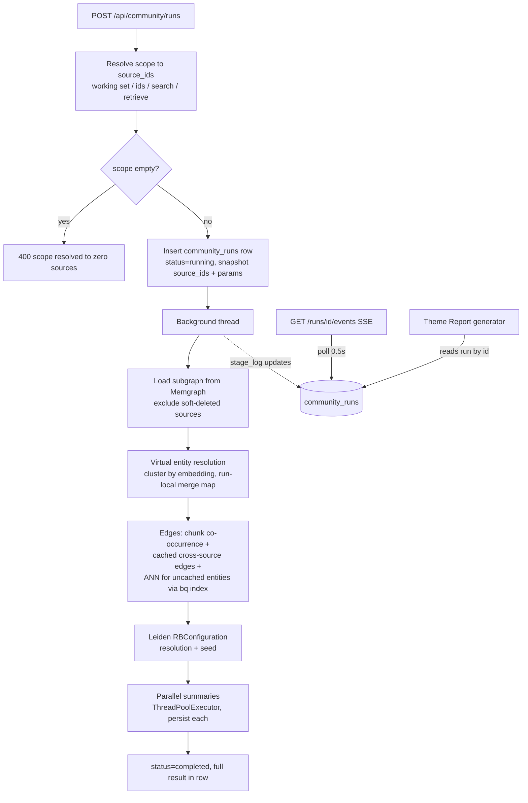
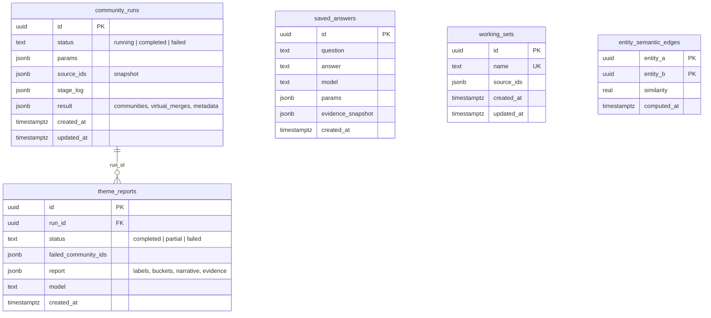

# Research Workspace and Community Engine Rework - Plan

## Goal Capsule

- **Objective:** Turn the tool into a research workspace: fix the community engine (correct, fast, cross-source, observable), add persisted Theme Reports, saved answers, and working sets, expose every capability consistently on API, CLI, frontend, and MCP, and restructure the frontend around explore → collect → analyze.
- **Authority:** This plan is authoritative for scope and decisions. The Product Contract defines WHAT; Key Technical Decisions and Implementation Units define HOW. Repo conventions in `AGENTS.md` and existing code patterns cited per unit override any ambiguity in prose.
- **Execution profile:** Implementation will be done by a less capable model. Every unit therefore names exact files, an existing exemplar to mirror, and explicit test scenarios. Follow the exemplars closely; do not invent new patterns when a cited one exists.
- **Stop conditions:** Stop and surface a blocker if: (a) a migration would mutate or delete existing data (all schema here is additive); (b) the `entities` binary-quantized index build fails or exceeds available memory; (c) any change would modify the intake/ingestion pipeline (out of scope, see Scope Boundaries); (d) a unit's verification cannot pass without changing another unit's contract.
- **Tail ownership:** After all units land, README (U20) and the Verification Contract gates must pass before the work is considered done.

---

## Product Contract

### Summary

Build a research workspace in two layers. Backend: the community engine gets persisted, addressable runs with SSE progress, indexed cross-source edge computation with a persistent cache, scope-time virtual entity resolution, a Leiden resolution knob, and parallel summarization — targeting under 90 seconds for scoped runs. New capabilities: Theme Reports (LLM analysis of a community run), saved answers, working sets (named source collections usable as scope everywhere), and a metadata facet endpoint. Frontend: a restructured shell with an Explore view (facet browse + pivots), a reworked Community view (full arguments with help text, live progress, run history), a Library for saved artifacts, and a redesigned login. All new capabilities reach API, CLI, frontend, and MCP (MCP read-only).

### Problem Frame

The owner uses this personal tool to collect trusted content and mine it for blog posts, LinkedIn posts, tweets, and knowledge work. Community detection — the main exploration feature — returns few, small, mostly single-source communities and is slow. Diagnosis (verified against the live database and code):

- The live `entities` table has **no vector index** (4096-dim embeddings exceed pgvector's 2000-dim HNSW cap; the plain index from the init schema does not exist on the live DB). Each community request runs up to 5,000 per-entity ANN queries as full sequential scans over 114k rows.
- Cross-source edges exist only through that per-request ANN pass; chunk co-occurrence edges are intra-source by construction. Nothing is cached; everything recomputes per request.
- Entity dedup at intake is exact-name-match only; graph edges are only Chunk-MENTIONS (relationship extraction is dormant). The weekly maintenance sweep merges semantic duplicates, but same-chunk co-occurrence still limits connectivity.
- LLM summarization is one serial blocking HTTP call per community.
- Community results are transient (list-index ids, unseeded Leiden), so nothing downstream can reference them.
- Soft-deleted sources leak into community scope (`_load_graph_data` filters only `chunks.deleted_at`, unlike retrieval which also filters `sources.deleted_at`).

Today the owner pastes raw community JSON into a ChatGPT Custom GPT to get labeled, quality-triaged, evidence-backed themes. That analysis layer belongs in the product. The frontend exposes almost none of the backend's tuning arguments, gives no progress feedback, persists nothing, and the "bucket" (copy source ids to a tray, paste into the community tab) is a workaround for a missing working-set concept.

### Requirements

**Community engine**

- R1. A scoped community run (roughly up to 100 sources) completes in under 90 seconds including summaries, measured as median of 3 runs on the live corpus.
- R2. Cross-source semantic edges are computed with a binary-quantized HNSW prefilter plus full-precision rerank on `entities.embedding` — never an unindexed `ORDER BY embedding <=>` scan.
- R3. Computed cross-source edges are cached in Postgres and reused by later runs; cache entries for an entity are invalidated when that entity is merged by the maintenance sweep. (Re-ingestion creates new entity ids, so old cache rows become orphaned-but-harmless; the sweep's invalidation phase also deletes rows referencing entity ids that no longer exist.)
- R4. Within a run's subgraph, near-duplicate entities (by embedding similarity) are merged virtually for that run only. Stored data is never mutated by a community run.
- R5. Leiden accepts a `resolution` parameter and a fixed random seed so identical inputs produce identical partitions.
- R6. Community summarization runs in parallel; one failed summary marks that community's summary as failed without failing the run.
- R7. Every community execution is persisted as a run with a stable `run_id`, stable per-run community ids, the resolved `source_ids` snapshot, and all parameters used.
- R8. Community run progress is observable over SSE (stage events with counts). A client disconnect does not stop the run; reconnecting replays progress from the persisted stage log.
- R9. Soft-deleted sources are excluded from community scope, matching retrieval behavior.
- R10. A scope that resolves to zero sources returns HTTP 400 with reason `"scope resolved to zero sources"`. Scope members that are missing or deleted are reported in `metadata.sources_excluded` with a reason, never dropped silently.

**Theme Reports**

- R11. A Theme Report is generated from a persisted community run and contains: per-community label, community type (`thematic_cluster`, `umbrella_cluster`, `vendor_list`, `source_fragment`, `noisy_artifact`), confidence 1–5, cross-source flag, key entities, key sources, 1–3 sentence summary; plus higher-order thematic buckets, a cross-community narrative, and cleanup recommendations.
- R12. Theme Reports are persisted, listable, and gettable. If some per-community LLM calls fail, the report is saved with status `partial` and a list of failed community ids; regeneration retries only the failed parts.

**Saved answers**

- R13. An answer can be saved with: question, answer text, model, all request arguments, and a denormalized evidence snapshot (source id, source name, chunk text at save time). Saved answers are listable and gettable and survive later source deletion.

**Working sets**

- R14. Working sets are named, persisted collections of source ids with create / rename / add-sources / remove-sources / delete operations.
- R15. A working set is usable as scope for search, retrieve, community, theme generation, and answer. Scope resolution snapshots the member ids at dispatch time; later edits to the set do not change an in-flight or completed run.

**Explore and facets**

- R16. A facet endpoint returns distinct values with counts for the metadata keys `kind`, `author`, `source`, `domain` over non-deleted sources, including an explicit `(none)` bucket for sources missing the key.

**Cross-surface parity**

- R17. Every new capability is exposed on API, CLI, and frontend; MCP exposes read/get/list tools for runs, theme reports, saved answers, working sets, and facets (no write tools).
- R18. Community arguments that exist in the engine but reach no surface today (`source_cooc_weight`, `cross_source_top_k`, `max_cross_source_queries`) plus the new `resolution` are exposed on all four surfaces.
- R19. Every request-model field has a one-line plain-language description in the Pydantic schema; the frontend shows that help text next to each argument input.

**Frontend**

- R20. The app shell is restructured: persistent sidebar navigation with views Explore, Search, Retrieve, Communities, Answer, Library, Working Sets; per-view components extracted from `App.tsx`; redesigned login screen that distinguishes "session expired" from "not logged in".
- R21. The Explore view browses sources by facet (with counts, including `(none)`), and every listed source or selection offers pivot actions: add to working set, run retrieve, run communities.
- R22. The Community view exposes all arguments with help text behind progressive disclosure (defaults visible, advanced collapsed), streams run progress with live counts, lists past runs, and can cancel the client's view of a run.
- R23. The Library view lists and opens saved answers and theme reports.
- R24. Every operation shows result counts on completion; long operations show streamed progress, not a bare spinner.

**Documentation**

- R25. README.md documents every new or changed capability in the existing structure: a `##` section per capability with `### CLI` and `### REST API` subsections, MCP tool notes in the MCP section, and every new config knob in the matching Environment subsection.

### Scope Boundaries

**Out of scope (do not touch):**

- The intake/ingestion pipeline (`src/rag/ingestion.py`, `src/rag/graph_extraction.py` extraction flow, chunking, embedding at intake). No changes to how documents are ingested or how entities are stored at intake.
- Reviving relationship extraction at intake.
- Corpus-wide precomputation of communities or edges. All computation is just-in-time; only results of work actually requested are cached.
- MCP write tools (create/delete working sets, trigger generation over MCP). Deferred until key scopes are enforced in the MCP middleware.
- Retrieval quality improvements. Virtual entity resolution applies inside community runs only; retrieve's graph expansion is unchanged.

**Deferred to follow-up work:**

- Standing-analysis feed (precomputed briefs, community diffs between runs).
- Per-principal ownership of working sets and artifacts (single-user today; all artifacts are global).
- MCP scope enforcement (`BearerAuthMiddleware` currently ignores `KeyRecord.scopes`) — required before any MCP write tool ships.
- React Router adoption; the shell keeps state-based view switching.

### Acceptance Examples

- AE1. **Given** a working set "AI infra" with 40 sources across 5 origins, **when** the user runs communities over it with `resolution=1.5`, **then** a run row is created, SSE events stream stages with counts, the run completes in under 90s, and at least one community spans sources from more than one origin (assuming the corpus supports it) with `cross_source: true` in its metadata.
- AE2. **Given** a completed community run, **when** the user generates a Theme Report and one community's LLM call times out, **then** the report is saved with `status: "partial"` and that community id in `failed_community_ids`, and regenerating retries only that community.
- AE3. **Given** a source soft-deleted via the sources API, **when** any new community run resolves scope, **then** that source contributes no entities or chunks, and if it was named explicitly in `source_ids` it appears in `metadata.sources_excluded` with reason `"deleted"`.
- AE4. **Given** the same community request sent via `POST /api/community`, `rag community ids ...`, and the MCP `community` tool, **then** all three produce the same partition (same seed, same parameters) and all three accept `resolution` and `source_cooc_weight`.
- AE5. **Given** a saved answer whose evidence cites a source that is later hard-deleted, **when** the user opens the saved answer, **then** the snapshot renders fully and the dead source link shows "source no longer available".

---

## Planning Contract

### Key Technical Decisions

- KTD1. **Binary-quantized HNSW index on `entities`, never a plain vector index.** `entities.embedding` is `vector(4096)`; pgvector HNSW caps at 2000 dims, which is why the live DB has no vector index and every ANN query seq-scans. Migration adds `CREATE INDEX ... USING hnsw ((binary_quantize(embedding)::bit(4096)) bit_hamming_ops)`, copying the proven pattern from `scripts/migrate/009_binary_quantized_vector_indexes.sql` (verify exact filename; it is the migration that added binary-quantized indexes for chunks/insights). Every query against it uses the prefilter-then-rerank shape from `dense_retrieve` in `src/rag/retrieval.py` and calls `set_hnsw_ef_search(conn, prefetch_count)` from `src/rag/db.py` first (the `ef_search` GUC otherwise caps candidates at 40 regardless of SQL LIMIT).
- KTD2. **Community runs are rows in a new `community_runs` table, not the ingestion `jobs` table.** The jobs table is ingestion-shaped (`source_id`, ingestion stages). Runs get their own table with the same lifecycle vocabulary (`status`, `stage_log` jsonb, timestamps) so the pattern is familiar. Every community execution — sync endpoint, CLI, MCP included — creates a run row.
- KTD3. **Run execution is a background thread in the API process; SSE reads the database.** `POST /api/community/runs` inserts the run row, starts a `threading.Thread` that executes the engine and writes progress into `community_runs.stage_log`, and returns `run_id` immediately. `GET /api/community/runs/{run_id}/events` is an SSE endpoint that polls the row (interval 0.5s) and emits new stage entries until status is terminal. This makes reconnect/replay trivial (progress is durable) and requires no in-memory pub/sub. Client abort closes the SSE response only; the thread finishes and persists. Two guards, because a killed process leaves daemon threads with no cleanup: (a) a **stale-run reaper** — any `running` row whose `updated_at` is older than `COMMUNITY_RUN_STALE_SECONDS` (default 600) is marked `failed` with reason `"stale"`, checked at `create_run` time and at maintenance-sweep start; (b) a **concurrency cap** — `create_run` rejects with a 429-shaped error when `COMMUNITY_MAX_CONCURRENT_RUNS` (default 3) non-terminal, non-stale runs exist.
- KTD4. **Cross-source edge cache: pair rows keyed on persistent entity ids.** Table `entity_semantic_edges(entity_a uuid, entity_b uuid, similarity real, computed_at timestamptz, primary key (entity_a, entity_b))` with `entity_a < entity_b` normalized ordering, plus an index on `entity_b`. Read-through: a run loads cached rows for its scope's entities, computes ANN only for entities that have no cache rows at all, and inserts what it computed. (`entities` has no `updated_at` column, so no per-row staleness comparison is possible — correctness comes from the sweep's invalidation deleting rows for merged entities, KTD6.) Invalidation deletes all rows touching an entity id (see KTD6). Cache rows are derived data — safe to truncate at any time.
- KTD5. **Virtual entity resolution is run-local and operates on persistent entities.** After loading the subgraph, cluster its entities by full-precision cosine similarity ≥ `COMMUNITY_VIRTUAL_MERGE_THRESHOLD` (default 0.90) using the bq-prefilter+rerank query shape restricted to the scope's entity ids. Pick each cluster's representative with the survivor rules from `docs/plans/2026-05-16-merge-duplicate-entities.md` (non-null embedding first, then oldest `created_at`). Merge is a mapping applied in-memory when building the igraph; the run output records `virtual_merges: [{representative_id, merged_ids, canonical_names}]`. Nothing is written to `entities` or Memgraph. Cache keys (KTD4) use persistent ids, so virtual merges never invalidate the cache.
- KTD6. **The weekly maintenance sweep owns cache invalidation.** `scripts/weekly_maintenance.py` gains a phase after entity merge that deletes `entity_semantic_edges` rows touching any entity id that was merged away or survived a merge (the sweep already holds cluster membership). The sweep's concurrency guard additionally refuses to start while any `community_runs.status` is non-terminal, and run dispatch refuses to start while the sweep's advisory lock is held.
- KTD7. **Leiden: `RBConfigurationVertexPartition` with `resolution_parameter`, seeded.** Replace `ModularityVertexPartition` with `leidenalg.RBConfigurationVertexPartition` passing `resolution_parameter=options.resolution` (default 1.0 — equivalent to modularity at 1.0, coarser below, finer above) and `seed=42` in `leidenalg.find_partition`. This gives R5 with one line of API surface.
- KTD8. **Parallelize LLM calls with `ThreadPoolExecutor`; never thread DB writes.** Repo convention (see `run_first_stage_retrieval` in `src/rag/retrieval.py`): threads are for remote LLM/HTTP calls only, each thread gets its own DB connection if it needs one, and DB/graph writes are batched on the main thread. Community summaries and theme-report per-community calls use a pool sized by `COMMUNITY_SUMMARY_MAX_WORKERS` (default 4). Each completed summary is persisted immediately so failures lose nothing.
- KTD9. **MCP stays read-only.** New MCP tools are get/list only: `list_community_runs`, `get_community_run`, `list_theme_reports`, `get_theme_report`, `list_answers`, `get_answer`, `list_working_sets`, `get_working_set`, `list_metadata_facets`. Generation and CRUD happen via API/CLI/frontend. The existing `community` MCP tool remains (it now records a run like every other execution). Rationale: the end workflow is Claude *reading* persisted artifacts; write tools require scope enforcement the middleware doesn't do yet. Caveat: until MCP scope enforcement lands, any valid API key has equal read access to all persisted artifacts (runs, themes, answers, working sets) — do not issue narrower-scoped keys expecting them to be honored over MCP.
- KTD10. **Argument help text lives in the Pydantic schemas.** Every field in `src/rag/api/schemas.py` request models gets `Field(description="...")`. A test asserts no exposed field has an empty description. The frontend keeps a mirrored `frontend/src/lib/argHelp.ts` map (schema field name → text copied from the schema); U18's test scenarios include spot-checks that the two agree for community arguments.
- KTD11. **Working sets are global (no owner column) and snapshot-on-use.** Single-user system; `Principal` ownership is deferred. Scope resolution copies member ids into the run/answer record at dispatch.
- KTD12. **The existing synchronous `POST /api/community` endpoint is kept** for CLI/MCP compatibility. It now executes through the same run-recording engine path and returns the full result inline plus the new `run_id`. New frontend flows use the async run endpoints.

### High-Level Technical Design

Community run lifecycle (new engine path):

New persistence (all additive, one migration):

### Assumptions

- The `entities` binary-quantized index builds successfully on ~114k rows of 4096-dim vectors within reasonable time/memory (the same pattern built on larger chunk/insight tables). If it fails, stop and surface.
- OpenRouter remains the LLM provider for summaries and theme reports, called with the existing `requests`/`httpx` pattern and existing model-selection config.
- The Custom GPT instructions the owner uses today are the authoritative spec for the Theme Report prompt content (encoded in U9's prompt constant).
- Single user; no concurrency beyond a handful of overlapping runs from multiple tabs/clients.

---

## Implementation Units

Unit Index:

| U-ID | Title | Key files | Depends on |
|---|---|---|---|
| U1 | Migration 013 + config knobs | `scripts/migrate/013_*.sql`, `src/rag/config.py`, `.env.example` | — |
| U2 | Scope correctness fixes | `src/rag/community.py` | — |
| U3 | Indexed + cached cross-source edges | `src/rag/community.py`, `src/rag/db.py` | U1 |
| U4 | Virtual entity resolution | `src/rag/community.py` | U1, U3 |
| U5 | Leiden resolution + parallel summaries | `src/rag/community.py` | U1, U2 |
| U6 | Community runs + SSE progress | `src/rag/community_runs.py`, `src/rag/api/routes/community.py` | U1, U2, U5 |
| U7 | Maintenance sweep integration | `scripts/weekly_maintenance.py` | U1, U3, U6 |
| U8 | Working sets | `src/rag/working_sets.py`, `src/rag/api/routes/working_sets.py`, scope plumbing | U1, U2, U6 |
| U9 | Theme Reports | `src/rag/themes.py`, `src/rag/prompts/__init__.py`, `src/rag/api/routes/themes.py` | U1, U6 |
| U10 | Saved answers | `src/rag/api/routes/answers.py` | U1 |
| U11 | Metadata facets | `src/rag/sources.py`, `src/rag/api/routes/sources.py` | — |
| U12 | Schema descriptions | `src/rag/api/schemas.py`, `tests/test_schema_descriptions.py` | U6, U8, U9, U10 |
| U13 | CLI parity | `src/rag/cli.py`, `src/rag/api_client.py` | U6, U8, U9, U10, U11, U12 |
| U14 | MCP parity | `src/rag/mcp_server.py` | U6, U8, U9, U10, U11, U12 |
| U15 | Cross-surface parity tests | `tests/test_surface_parity.py` | U13, U14 |
| U16 | Frontend shell + login | `frontend/src/App.tsx`, `frontend/src/views/*`, `frontend/src/auth/Login.tsx` | — |
| U17 | Explore view + working set builder | `frontend/src/views/ExploreView.tsx` | U8, U11, U16 |
| U18 | Community view rework | `frontend/src/views/CommunityView.tsx`, `frontend/src/lib/api.ts` | U6, U12, U16 |
| U19 | Library + theme view + answer upgrades | `frontend/src/views/{LibraryView,AnswerView}.tsx` | U9, U10, U16 |
| U20 | README update | `README.md` | all backend units |

### U1. Migration 013 and config knobs

- **Goal:** All new schema and settings exist so later units only write code.
- **Requirements:** R2, R3, R5, R7, R12, R13, R14.
- **Dependencies:** none.
- **Files:** `scripts/migrate/013_research_workspace.sql` (new), `src/rag/config.py`, `.env.example`.
- **Approach:** One idempotent SQL file (header comment `-- Migration 013: research workspace. Idempotent: safe to re-run.`) creating, with `IF NOT EXISTS` everywhere: (1) the binary-quantized HNSW index on `entities` copying the exact expression/opclass pattern from the migration that added `binary_quantize(...)::bit(...)` `bit_hamming_ops` indexes for chunks/insights (find it in `scripts/migrate/`, it is migration 009); (2) tables `community_runs`, `theme_reports`, `saved_answers`, `working_sets`, `entity_semantic_edges` exactly as in the ER diagram (uuid PKs default `gen_random_uuid()`, jsonb defaults `'{}'`/`'[]'`, `working_sets.name` unique, `entity_semantic_edges` composite PK plus an index on `entity_b`). Also mirror into the fresh-install init schema `scripts/init/postgres/02_schema.sql` — but note that file is stale: it still declares `entities.embedding`/`chunks.embedding` as `vector(1536)` with plain HNSW indexes (the 4096-dim state exists only via migrations 002/005, and plain HNSW is impossible at 4096 dims). First update the init schema to `vector(4096)` and remove the plain `entities_embedding_hnsw_idx`/`chunks_embedding_hnsw_idx` index statements, then add the new tables and bq index so fresh installs match the live corpus. New settings in `src/rag/config.py` following the existing `COMMUNITY_` group style (UPPER_SNAKE, `Annotated[..., Field(...)]`, grouped comment): `COMMUNITY_RESOLUTION: float = 1.0`, `COMMUNITY_VIRTUAL_MERGE_THRESHOLD: float = 0.90`, `COMMUNITY_SUMMARY_MAX_WORKERS: int = 4`, `COMMUNITY_EDGE_CACHE_PREFETCH: int = 250`, `COMMUNITY_MAX_CONCURRENT_RUNS: int = 3`, `COMMUNITY_RUN_STALE_SECONDS: int = 600`, `THEME_REPORT_MODEL: str = ""` (empty = reuse community summarize model), `THEME_REPORT_PROMPT: str = ""` (override hook). Mirror each in `.env.example` with an inline comment.
- **Patterns to follow:** `scripts/migrate/008_auth_and_workers.sql` (idempotent DDL style), migration 009 (bq index expression), `src/rag/config.py` community section.
- **Test scenarios:** Test expectation: none — pure DDL/config. Verification is applying the migration twice.
- **Verification:** `docker compose exec -T postgres psql -U rag -d rag -f scripts/migrate/013_research_workspace.sql` succeeds twice in a row; `\di entities*` shows the new index; `SELECT` from each new table works.

### U2. Scope correctness fixes

- **Goal:** Community scope excludes soft-deleted sources, rejects empty scope, and reports excluded members.
- **Requirements:** R9, R10.
- **Dependencies:** none.
- **Files:** `src/rag/community.py`, `tests/test_community.py`, `tests/test_api_community.py`.
- **Approach:** In `_load_graph_data`, join `sources` and add `AND s.deleted_at IS NULL`, copying the filter shape retrieval already uses (`src/rag/retrieval.py` around lines 332–333). In `_resolve_scope` / `detect_communities`: after resolution, if the source id list is empty raise `ValueError("scope resolved to zero sources")` (the route already translates `ValueError` to 400 — mirror `src/rag/api/routes/jobs.py` error handling if community's route does not). For `ids` scope, check which requested ids exist and are non-deleted; report the rest in `metadata.sources_excluded` as `{source_id, reason}` with reasons `"deleted"` or `"not_found"`, extending the existing `sources_excluded` structure in `community.py` (near line 489).
- **Patterns to follow:** `src/rag/retrieval.py` deleted-filter; existing `sources_excluded` metadata.
- **Test scenarios:**
  - Covers AE3. Soft-deleted source in `ids` scope contributes no chunks/entities and appears in `sources_excluded` with reason `"deleted"` (mock DB rows).
  - Scope resolving to `[]` raises `ValueError`; API test asserts `POST /api/community` returns 400 with the reason string.
  - Unknown source id appears with reason `"not_found"`; remaining valid ids still produce a result.
- **Verification:** `uv run pytest tests/test_community.py tests/test_api_community.py` passes.

### U3. Indexed and cached cross-source edges

- **Goal:** Cross-source edge computation uses the bq index and a persistent read-through cache instead of per-request sequential scans.
- **Requirements:** R2, R3, R1.
- **Dependencies:** U1.
- **Files:** `src/rag/community.py` (`_load_cross_source_semantic_edges`), `src/rag/db.py` (only if a shared helper is added), `tests/test_community.py`.
- **Approach:** Rewrite `_load_cross_source_semantic_edges` in three steps. (1) Load cached edges: `SELECT entity_a, entity_b, similarity FROM entity_semantic_edges WHERE entity_a = ANY(%s) AND entity_b = ANY(%s)` for the scope's entity ids. (2) For entities with no cached rows, run the ANN query using the prefilter-then-rerank shape copied from `dense_retrieve` in `src/rag/retrieval.py`: a CTE ordering by `binary_quantize(embedding)::bit(4096) <~> binary_quantize(%s::vector)::bit(4096)` with `LIMIT` = `COMMUNITY_EDGE_CACHE_PREFETCH`, reranked by full `<=>` cosine, keeping `top_k` above `COMMUNITY_SEMANTIC_THRESHOLD`; call `set_hnsw_ef_search(conn, settings.COMMUNITY_EDGE_CACHE_PREFETCH)` first (helper in `src/rag/db.py`). Keep the existing budget knob `max_cross_source_queries` and the cross-source-only condition (skip pairs sharing a source). (3) Batch-insert newly computed pairs into `entity_semantic_edges` with `ON CONFLICT DO NOTHING`, normalized `entity_a < entity_b`, on the main thread. Edge weight semantics are unchanged (`similarity * 0.5`, never overwrite a stronger existing edge).
- **Patterns to follow:** `dense_retrieve` prefilter+rerank in `src/rag/retrieval.py`; `set_hnsw_ef_search` usage in `src/rag/retrieval.py` / `src/rag/insight_extraction.py`; multi-row insert batching convention.
- **Test scenarios:**
  - Cached pairs are used without issuing ANN queries (mock connection; assert query count).
  - Uncached entity triggers ANN and its results are inserted into the cache (assert insert executed with normalized ordering `entity_a < entity_b`).
  - Pair sharing a source id is skipped (existing behavior preserved).
  - `max_cross_source_queries` still bounds the number of ANN queries.
- **Verification:** unit tests pass; on the live DB, `EXPLAIN (ANALYZE, BUFFERS)` of the prefilter query shows an index scan on the new `entities` index, not a seq scan; a repeated community run over the same scope is measurably faster (cache hit).

### U4. Virtual entity resolution

- **Goal:** Near-duplicate entities within a run's subgraph are merged for that run only, so fragmented names cluster together.
- **Requirements:** R4.
- **Dependencies:** U1, U3.
- **Files:** `src/rag/community.py`, `tests/test_community.py`.
- **Approach:** New private function `_virtual_resolve(entities) -> dict[str, str]` (merged id → representative id). Compute pairwise candidates among the scope's entities using the same bq-prefilter+rerank query as U3 but restricted with `WHERE id = ANY(%s)` (scope entity ids) and threshold `COMMUNITY_VIRTUAL_MERGE_THRESHOLD`. Union-find the pairs into clusters. Representative selection: non-null embedding first, then oldest `created_at` (the survivor rules documented in `docs/plans/2026-05-16-merge-duplicate-entities.md`). Apply the mapping when building the igraph in `_build_igraph`: merged entities collapse to one vertex whose `source_ids` is the union and whose display name lists the representative's `canonical_name`. Record `virtual_merges` (list of `{representative_id, merged_ids, canonical_names}`) in the run result metadata. Never write to `entities` or Memgraph. Gate the whole step behind threshold > 0 (0 disables).
- **Patterns to follow:** union-find/cluster logic in `scripts/merge_semantic_duplicates.py` (read it; reuse its clustering approach in-memory without the write half).
- **Test scenarios:**
  - Two entities with similarity above threshold from different sources collapse to one vertex whose `source_ids` is the union (mock similarity query).
  - Representative choice follows survivor rules (entity with embedding beats one without; older wins tie).
  - Threshold 0 disables resolution (mapping empty, graph identical to pre-U4 behavior).
  - `virtual_merges` metadata lists every merged id exactly once.
- **Verification:** `uv run pytest tests/test_community.py` passes.

### U5. Leiden resolution and parallel summaries

- **Goal:** Tunable, reproducible partitions; summaries that are fast and failure-tolerant.
- **Requirements:** R5, R6, R1.
- **Dependencies:** U1, U2.
- **Files:** `src/rag/community.py`, `src/rag/api/schemas.py` (`CommunityOptions`), `tests/test_community.py`.
- **Approach:** In `_run_leiden`, switch to `leidenalg.RBConfigurationVertexPartition` with `resolution_parameter=resolution` and `seed=42` (both new function params; `resolution` flows from `CommunityOptions.resolution`, default `settings.COMMUNITY_RESOLUTION`). Replace the serial summary loop (`community.py` around lines 481–483) with a `concurrent.futures.ThreadPoolExecutor(max_workers=settings.COMMUNITY_SUMMARY_MAX_WORKERS)` mapping `_summarize_community` over communities; each future's exception is caught and stored as `summary_error` on that community instead of raising. Threads make only the HTTP call — no DB access inside workers.
- **Patterns to follow:** `ThreadPoolExecutor` usage in `run_first_stage_retrieval`, `src/rag/retrieval.py`; add `resolution` to `CommunityOptions` with `Field(default=None, gt=0, description=...)`.
- **Test scenarios:**
  - Same graph + same seed + same resolution produces identical membership across two calls.
  - Higher resolution produces at least as many communities as lower resolution on a fixture graph.
  - One summary raising an exception leaves that community with `summary_error` set and the run result intact (mock the HTTP call).
  - Summaries for N communities issue N HTTP calls (mock) and run concurrently (pool used; do not assert timing).
- **Verification:** `uv run pytest tests/test_community.py tests/test_api_community.py` passes.

### U6. Community runs and SSE progress

- **Goal:** Every community execution is a persisted, addressable run; progress streams over SSE and survives reconnects.
- **Requirements:** R7, R8, R10.
- **Dependencies:** U1, U2, U5.
- **Files:** `src/rag/community_runs.py` (new), `src/rag/api/routes/community.py`, `src/rag/api/schemas.py`, `tests/test_community_runs.py` (new), `tests/test_api_community.py`.
- **Approach:** New module `community_runs.py` with: `create_run(request) -> run_id` (resolve scope; 400-shaped `ValueError` on empty; insert row with params + `source_ids` snapshot, status `running`); `execute_run(run_id)` (calls the engine; between stages writes `stage_log` entries `{stage, at, counts}` — stages: `resolve_scope` (source count), `load_graph` (entity/chunk counts), `virtual_resolution` (merge count), `edges` (edge count, cache hits/misses), `leiden` (community count), `summaries` (done/total), terminal `completed`/`failed` with `result`/error); `get_run(run_id)`, `list_runs(limit, offset)`. Stage-log writing mirrors `_update_stage`/`_complete_stage` in `src/rag/ingestion.py` (jsonb append via `UPDATE`). `create_run` enforces the two KTD3 guards: first reap stale runs (`running` with `updated_at` older than `COMMUNITY_RUN_STALE_SECONDS` → mark `failed` reason `"stale"`), then reject with a 429-shaped error when `COMMUNITY_MAX_CONCURRENT_RUNS` non-terminal runs remain. The community route today has no `ValueError` → 400 translation — add the try/except explicitly (mirror `src/rag/api/routes/jobs.py`) on both the sync and the runs endpoints. Routes in `routes/community.py`: `POST /api/community/runs` (creates row, starts `threading.Thread(target=execute_run, daemon=True)`, returns `{run_id}`), `GET /api/community/runs` (list), `GET /api/community/runs/{id}` (full row), `GET /api/community/runs/{id}/events` (SSE: `EventSourceResponse` yielding one event per new `stage_log` entry, polling the row every 0.5s with a fresh short-lived connection, ending after terminal status with a final `result` event; copy the `EventSourceResponse` dict-yield style from `src/rag/api/routes/workers.py` log tail). The existing `POST /api/community` handler now calls `create_run` + `execute_run` synchronously and returns the result dict with `run_id` added — same response shape as today plus one key.
- **Patterns to follow:** `src/rag/api/routes/jobs.py` (list/get row-to-model), `src/rag/ingestion.py` stage helpers, `src/rag/api/routes/workers.py` SSE.
- **Test scenarios:**
  - Covers AE1 (partially). `POST /api/community/runs` returns a `run_id`; `GET .../{id}` shows the snapshot `source_ids` and params.
  - Sync `POST /api/community` response includes `run_id` and a row exists for it.
  - SSE endpoint replays already-written `stage_log` entries for a completed run then closes (TestClient with `stream=True` or iterate the generator directly).
  - Empty scope: `POST /api/community/runs` returns 400 and no row is inserted.
  - A `running` row with `updated_at` older than the stale threshold is marked `failed` by the next `create_run` call; a fresh run then starts normally.
  - With `COMMUNITY_MAX_CONCURRENT_RUNS` non-terminal runs present, `create_run` returns a 429-shaped error.
- **Verification:** `uv run pytest tests/test_community_runs.py tests/test_api_community.py` passes.

### U7. Maintenance sweep integration

- **Goal:** The weekly sweep invalidates stale edge cache and cannot race community runs.
- **Requirements:** R3.
- **Dependencies:** U1, U3, U6.
- **Files:** `scripts/weekly_maintenance.py`, `tests/test_weekly_maintenance.py` (create if absent; match existing script-test conventions if present).
- **Approach:** Add a phase after entity merge: collect every entity id involved in the merge phase (merged-away and survivors — the merge code already has cluster membership), then `DELETE FROM entity_semantic_edges WHERE entity_a = ANY(%s) OR entity_b = ANY(%s)`; also delete cache rows whose entity ids no longer exist in `entities` (covers hard-deleted/re-ingested sources). Log deleted-row count. Skip entirely when the merge phase merged nothing and no orphans exist (mirror the existing "only vacuum when `total_merged > 0`" discipline). Extend the sweep's start-up concurrency guard (it already checks non-terminal `jobs` rows and takes an advisory lock) to first reap stale runs per KTD3, then refuse to start when any non-stale `community_runs.status = 'running'` remains; and in `community_runs.create_run`, refuse (HTTP 409-shaped error) when the sweep's advisory lock is held (query `pg_locks` for the sweep's advisory lock id, reusing the lock key constant from the script).
- **Patterns to follow:** existing phase structure and guard in `scripts/weekly_maintenance.py`; vacuum-only-on-change discipline from `docs/solutions/database-issues/postgres-toast-bloat-memgraph-schema-drift-and-hnsw-ef-search-cap.md`.
- **Test scenarios:**
  - Merge of entities A→B deletes cache rows touching both A and B (mock connection assertions).
  - No merges → no cache delete executed.
  - Sweep refuses to start while a run row has status `running`.
- **Verification:** `uv run pytest` for the touched tests; dry-run `python scripts/weekly_maintenance.py --dry-run` (or its documented flag) still works.

### U8. Working sets

- **Goal:** Named source collections with CRUD, usable as scope for every scoped operation.
- **Requirements:** R14, R15.
- **Dependencies:** U1, U2, U6.
- **Files:** `src/rag/working_sets.py` (new), `src/rag/api/routes/working_sets.py` (new), `src/rag/api/main.py` (register router), `src/rag/api/schemas.py`, `src/rag/community.py` (`_resolve_scope`), `src/rag/api/routes/{search,retrieve,answer}.py` as needed, `tests/test_api_working_sets.py` (new).
- **Approach:** Business module with `create(name, source_ids)`, `get`, `list_all`, `rename`, `add_sources`, `remove_sources`, `delete` — plain SQL against `working_sets`, `ValueError` on unknown id or duplicate name. Router follows the CRUD style of `src/rag/api/routes/jobs.py` (inline Pydantic models, `_row_to_model` helper, `ValueError`→400/404), registered in `create_app()`'s gated list. Scope plumbing: add scope mode `working_set` to community's `_resolve_scope` (criterion = working set id; resolves to its member ids, then existing not-found/deleted filtering from U2 applies). For search/retrieve/answer: add optional `working_set_id` to their request schemas; when present, resolve to source ids and pass through the existing `source_ids` filter path those operations already support. Resolution always copies ids (snapshot) — no operation holds a live reference.
- **Patterns to follow:** `src/rag/api/routes/jobs.py` CRUD; `RetrieveRequest.source_ids` filter path in `src/rag/retrieval.py`.
- **Test scenarios:**
  - CRUD round-trip: create, get, rename, add/remove sources, delete; duplicate name → 400; unknown id → 404.
  - Community run with `scope_mode="working_set"` resolves to the set's members; run row snapshot equals members at dispatch; mutating the set afterward does not change the stored snapshot.
  - Retrieve with `working_set_id` passes the resolved ids into the retrieval scope (patch business layer, assert kwargs).
  - Empty working set used as scope → 400 (via U2 rule).
- **Verification:** `uv run pytest tests/test_api_working_sets.py tests/test_api_community.py` passes.

### U9. Theme Reports

- **Goal:** The LLM analyst layer, in-product: generate, persist, list, get, and partially regenerate theme reports from a community run.
- **Requirements:** R11, R12.
- **Dependencies:** U1, U6.
- **Files:** `src/rag/themes.py` (new), `src/rag/prompts/__init__.py`, `src/rag/api/routes/themes.py` (new), `src/rag/api/main.py`, `src/rag/api/schemas.py`, `tests/test_themes.py` (new), `tests/test_api_themes.py` (new).
- **Approach:** Two new prompt constants in `src/rag/prompts/__init__.py` following the existing UPPER_SNAKE + `str.format` style: `THEME_COMMUNITY_ANALYSIS` (input: one community's entities, sources, top chunks, cross-source flag; output JSON: `label` (3–7 words, concrete), `community_type` (one of the five R11 values), `confidence` (1–5), `summary` (1–3 sentences), `key_entities`, `key_sources`, `relevance`) and `THEME_SYNTHESIS` (input: all per-community analyses; output JSON: `buckets` (name + member community ids + why), `narrative` (cross-community synthesis), `cleanup_recommendations`). Content encodes the analyst behavior: conservative labeling, evidence vs interpretation separation, the five community-type heuristics (umbrella/vendor-list/source-fragment/thematic/noisy). `settings.THEME_REPORT_PROMPT` overrides the analysis prompt when non-empty (mirror the `COMMUNITY_SUMMARIZATION_PROMPT` override in `community.py`). `themes.py`: `generate_theme_report(run_id, model) -> report_id` — load the run (404-shaped error if missing or not `completed`), fan out per-community analysis calls with the U5 thread pool pattern, persist each result into the report row as it completes, run the synthesis call over successful analyses, set status `completed` (all analyses and synthesis succeeded), `partial` (some analyses failed but synthesis over the rest succeeded; record `failed_community_ids`), or `failed` (synthesis failed or every analysis failed); `regenerate(report_id)` retries only failed ids and re-runs synthesis; `get_report`, `list_reports`. LLM call helper mirrors `_summarize_community`'s OpenRouter POST (JSON response mode; on JSON parse failure treat as failed community). Routes: `POST /api/themes` (`{run_id, model?}` → `{report_id}`, synchronous — the parallel fan-out keeps it inside the latency budget), `POST /api/themes/{id}/regenerate`, `GET /api/themes`, `GET /api/themes/{id}`. Register the router in `create_app()`'s gated list with `dependencies=gated`, exactly like the existing business routers — a router added without that list is unauthenticated. Evidence in the report references run_id + community ids (the run row holds full community content per KTD2, so the report needs no extra snapshot).
- **Patterns to follow:** prompt constants + override hook; `_summarize_community` HTTP shape; U5 pool pattern; jobs-style CRUD routes.
- **Test scenarios:**
  - Covers AE2. One community's LLM call raising → report saved `partial` with that id in `failed_community_ids`; regenerate retries only it (mock call counts) and flips to `completed`.
  - Happy path: N communities → N analysis calls + 1 synthesis call; report row contains labels, buckets, narrative.
  - LLM returning invalid JSON marks that community failed, not the whole report.
  - Synthesis call failing sets report status `failed` (analyses preserved for regenerate).
  - Generating from a nonexistent or non-completed run → 404/400.
  - Request without credentials gets 401 on every themes route (auth gating).
- **Verification:** `uv run pytest tests/test_themes.py tests/test_api_themes.py` passes.

### U10. Saved answers

- **Goal:** Answers become durable artifacts with self-contained evidence.
- **Requirements:** R13.
- **Dependencies:** U1.
- **Files:** `src/rag/api/routes/answers.py` (new), `src/rag/api/main.py`, `src/rag/api/schemas.py`, `frontend` untouched here, `tests/test_api_answers.py` (new).
- **Approach:** `POST /api/answers` accepts `{question, answer, model, params, evidence}` where `evidence` is the `results` payload the answer stream already delivers to the client (chunks with `source_id`, source name, text) — the client sends back what it received (denormalized by construction, so it survives source deletion). Validate `evidence` with a bounded Pydantic model (a list of objects with exactly `source_id`, `source_name`, `text`, each string length-capped) rather than accepting an open-ended JSON blob; store the validated shape as `evidence_snapshot`. `GET /api/answers` (list: id, question, model, created_at), `GET /api/answers/{id}` (full), `DELETE /api/answers/{id}`. Plain CRUD in the jobs.py style; no business module needed. Register the router in `create_app()`'s gated list with `dependencies=gated` — a router added without that list is unauthenticated.
- **Patterns to follow:** `src/rag/api/routes/jobs.py`.
- **Test scenarios:**
  - Covers AE5 (backend half). Save → get returns identical evidence snapshot; snapshot content is returned even when the referenced source id no longer exists.
  - List returns newest first; delete → subsequent get 404.
  - Missing required fields → 422; evidence items with unexpected shape or over-length text → 422.
  - Request without credentials gets 401 on every answers route (auth gating).
- **Verification:** `uv run pytest tests/test_api_answers.py` passes.

### U11. Metadata facets

- **Goal:** Facet discovery for the Explore view and MCP agents, with `(none)` visibility.
- **Requirements:** R16.
- **Dependencies:** none.
- **Files:** `src/rag/sources.py`, `src/rag/api/routes/sources.py`, `tests/test_api_sources.py` (extend).
- **Approach:** `list_metadata_facets() -> {key: [{value, count}]}` for keys `kind`, `author`, `source`, `domain`: one SQL query per key — `SELECT COALESCE(metadata->>%s, '(none)') AS value, count(*) FROM sources WHERE deleted_at IS NULL GROUP BY 1 ORDER BY count(*) DESC` (the COALESCE produces the `(none)` bucket). Expose as `GET /api/sources/facets`. Also extend the existing source-list filter path so a filter value of `(none)` matches `metadata->>key IS NULL` (letting users select unattributed sources). Filter combination semantics: multiple selected values within one facet key combine with OR; different facet keys combine with AND. Facet counts are corpus-wide (computed unfiltered) — no per-filter recomputation in this release.
- **Patterns to follow:** existing `list_sources` filtering in `src/rag/sources.py` and its route.
- **Test scenarios:**
  - Sources missing the `source` key appear under `(none)` with the right count; deleted sources are excluded.
  - Filtering the source list by `source=(none)` returns only rows lacking the key.
  - Counts sum to the number of non-deleted sources per key.
- **Verification:** `uv run pytest tests/test_api_sources.py` passes.

### U12. Schema descriptions

- **Goal:** Every exposed argument has canonical one-line help text.
- **Requirements:** R19, R18.
- **Dependencies:** U6, U8, U9, U10.
- **Files:** `src/rag/api/schemas.py`, `tests/test_schema_descriptions.py` (new).
- **Approach:** Add `description=` to every field of every request model in `schemas.py` (including nested option models — `SearchOptions`, `RetrieveOptions`, `CommunityOptions`, new models). Descriptions are plain language stating what the argument does and when to change it, e.g. `resolution`: "Community granularity. 1.0 is balanced; below 1.0 merges into fewer, larger communities; above 1.0 splits into more, smaller ones." Also add the missing existing knobs to `CommunityOptions` if not already present: `source_cooc_weight`, `cross_source_top_k`, `max_cross_source_queries` (they exist in the engine; `cross_source_top_k`/`max_cross_source_queries` exist in the backend schema but are dropped by the frontend — the schema is the canonical set). The new test walks every `BaseModel` subclass in `schemas.py` via `model_fields` and asserts each field has a non-empty description.
- **Patterns to follow:** existing `Field(...)` validators in `schemas.py`.
- **Test scenarios:**
  - The walker test fails when any field lacks a description (assert against all request models).
- **Verification:** `uv run pytest tests/test_schema_descriptions.py` passes.

### U13. CLI parity

- **Goal:** Every new capability is drivable from the `rag` CLI in both API and direct modes.
- **Requirements:** R17, R18.
- **Dependencies:** U6, U8, U9, U10, U11.
- **Files:** `src/rag/cli.py`, `src/rag/api_client.py`, `tests/test_cli_community.py` (extend), `tests/test_cli_working_sets.py` (new), `tests/test_api_client.py` (extend).
- **Approach:** New Typer sub-apps mounted with `app.add_typer(...)`: `working-set` (`create`, `list`, `show`, `add`, `remove`, `rename`, `delete`), `themes` (`generate --run-id`, `list`, `show`, `regenerate`), `answers` (`list`, `show`, `save` optional), plus `rag community runs` (`list`, `show`) and `rag sources facets`. Extend existing `community` commands with `--resolution`, `--source-cooc-weight`, `--cross-source-top-k`, `--max-cross-source-queries`, `--working-set` (scope mode). Every command follows the dual-mode dispatch pattern: `if _use_api():` → `RagClient` method (add one thin method per endpoint in `src/rag/api_client.py` mirroring `community(payload)`), else direct business-layer call via the lazy-import shim style at the top of `cli.py`. Build payloads with the existing drop-`None` dict comprehension.
- **Patterns to follow:** `community_app` commands in `src/rag/cli.py`; `RagClient` method shape in `src/rag/api_client.py`; test styles in `tests/test_cli_community.py` (CliRunner + patch) and `tests/test_api_client.py` (MockTransport).
- **Test scenarios:**
  - Covers AE4 (CLI leg). `rag community ids --resolution 1.5 --source-cooc-weight 0.2` passes both values through in direct mode (patched `detect_communities` kwargs) and API mode (MockTransport asserts body).
  - `rag working-set create/add/show` round-trip in API mode.
  - `rag themes generate --run-id X` posts `{run_id}`; `rag themes show` prints the report JSON.
  - Direct mode still works with no `RAG_SERVER_URL` set (conftest isolation fixture).
- **Verification:** `uv run pytest tests/test_cli_community.py tests/test_cli_working_sets.py tests/test_api_client.py` passes.

### U14. MCP parity

- **Goal:** Agents (Claude over MCP) can read every persisted artifact and discover facets.
- **Requirements:** R17, R18.
- **Dependencies:** U6, U8, U9, U10, U11.
- **Files:** `src/rag/mcp_server.py`, `tests/test_mcp_server.py` (extend).
- **Approach:** Add read-only tools in `_build_server()` following the existing `@mcp.tool()` + lazy-import + return-dict style: `list_community_runs`, `get_community_run`, `list_theme_reports`, `get_theme_report`, `list_answers`, `get_answer`, `list_working_sets`, `get_working_set`, `list_metadata_facets`. Each delegates to the same business function the REST route uses. Extend the existing `community` tool's options to include `resolution`, `source_cooc_weight`, `cross_source_top_k`, `max_cross_source_queries`, and the `working_set` scope mode. Docstrings (they become tool descriptions) state what each tool returns and that it is read-only. Do not add any write/generate tool.
- **Patterns to follow:** existing five tools in `src/rag/mcp_server.py`.
- **Test scenarios:**
  - Covers AE4 (MCP leg). MCP `community` tool passes `resolution` through to `detect_communities` (patched).
  - `get_theme_report` returns the persisted report for a fixture id; unknown id surfaces the business-layer error.
  - Tool listing contains all nine new tools and no write tool.
  - Tests use the TestClient-with-lifespan pattern the existing MCP tests require.
- **Verification:** `uv run pytest tests/test_mcp_server.py` passes.

### U15. Cross-surface parity tests

- **Goal:** Drift between surfaces fails CI instead of shipping silently.
- **Requirements:** R17, R18.
- **Dependencies:** U13, U14.
- **Files:** `tests/test_surface_parity.py` (new).
- **Approach:** Structural assertions, not end-to-end runs: (1) every field of `CommunityOptions` in `schemas.py` appears in the MCP `community` tool's accepted options and has a matching `--` option on the CLI community commands (introspect the Typer command params); (2) for each artifact type (runs, themes, answers, working sets, facets) an API route, a `RagClient` method, and an MCP tool exist (name-based assertions); (3) the frontend `CommunityRequestOptions` type is NOT checked here (TypeScript; covered by U18's vitest). Keep each assertion's failure message explicit about which surface is missing what.
- **Patterns to follow:** plain pytest module; introspection via `typer` command registry and `mcp` tool listing used in `tests/test_mcp_server.py`.
- **Test scenarios:** the module IS the scenarios; it must fail if a future arg is added to `CommunityOptions` without CLI/MCP exposure (verify by temporarily adding a dummy field during development, then removing it).
- **Verification:** `uv run pytest tests/test_surface_parity.py` passes.

### U16. Frontend shell and login

- **Goal:** Workspace shell with sidebar navigation, extracted views, redesigned login.
- **Requirements:** R20.
- **Dependencies:** none (frontend can start in parallel with backend).
- **Files:** `frontend/src/App.tsx`, `frontend/src/views/` (new directory: `SearchView.tsx`, `RetrieveView.tsx`, `AnswerView.tsx`, `CommunityView.tsx`, `ExploreView.tsx`, `LibraryView.tsx`, `WorkingSetsView.tsx`), `frontend/src/auth/Login.tsx`, `frontend/src/styles/`, `frontend/src/App.test.tsx`.
- **Approach:** Mechanical extraction first: move each existing mode's JSX + state from `App.tsx` into a view component under `frontend/src/views/` with props for shared services; `App.tsx` keeps the `Mode` union (extended to `"explore" | "library" | "working_sets"`), auth gating, and layout. The default view after login is **Explore** (matches the explore → collect → analyze narrative). New layout: fixed left sidebar (app name, nav items with icons/labels, active state) + main content area, replacing the top tab row; keep the Tailwind-utilities-plus-semantic-classes styling mix. Login redesign: centered card, app identity, username/password, error states; when the auth listener fires from an expired session show "Your session expired — sign in again" (pass a flag through `AuthContext`'s existing `onAuthError` path) vs. the plain first-visit prompt. No router library; view switching stays state-based.
- **Patterns to follow:** existing component conventions (`type XProps`, default-export function components); `AuthContext` states; `App.test.tsx` renderApp harness.
- **Test scenarios:**
  - Each nav item switches the visible view (Testing Library: click nav, assert view heading).
  - Existing search/retrieve/answer/community tests still pass after extraction (update selectors minimally).
  - Expired-session flag renders the "session expired" message on the login screen; fresh anonymous state does not.
- **Verification:** `cd frontend && npx vitest run` passes.

### U17. Explore view and working set builder

- **Goal:** Browse-by-facet entry point with pivot actions; the bucket becomes working sets.
- **Requirements:** R21, R14 (UI), R24.
- **Dependencies:** U8, U11, U16.
- **Files:** `frontend/src/views/ExploreView.tsx`, `frontend/src/views/WorkingSetsView.tsx`, `frontend/src/lib/api.ts`, `frontend/src/components/` (facet sidebar, source row, selection bar), remove/replace `frontend/src/components/BucketPopover.tsx` usage, tests in `frontend/src/App.test.tsx` or view-level test files.
- **Approach:** `api.ts`: add types + functions `getFacets()`, working set CRUD (`listWorkingSets`, `createWorkingSet`, `updateWorkingSet`, `deleteWorkingSet`) following the `postJson` conventions. ExploreView: left facet panel (keys kind/author/source/domain; values with counts including `(none)`; multi-select filters — within a key OR, across keys AND; small caption noting counts are corpus-wide), main source list (name, origin, kind, date; result count header), selection checkboxes with a sticky action bar: "Add to working set…" (picker + create-new), "Run communities", "Run retrieve" (navigates to that view pre-scoped to the selection). WorkingSetsView: list sets with member counts; open a set to view/remove members; rename/delete; "Use as scope" buttons navigating to community/retrieve/answer pre-filled. The old bucket flow is retired: `BucketPopover` is removed and its add-to-bucket affordances become add-to-working-set. Empty states with a call-to-action, not blank panels: Working Sets ("No working sets yet — select sources in Explore to create one") and a zero-result filtered source list ("No sources match these facets — clear filters").
- **Patterns to follow:** `SourcesExplorer.tsx` list rendering; `api.ts` function shape.
- **Test scenarios:**
  - Facet click filters the source list request (mock fetch asserts filter params) and `(none)` is selectable.
  - Selecting two sources and adding to a new working set issues create with both ids.
  - "Run communities" from a selection lands on the Community view with those ids as scope.
  - Result count renders after list load.
- **Verification:** `cd frontend && npx vitest run` passes.

### U18. Community view rework

- **Goal:** Full-argument community UI with live streamed progress, run history, and cancel.
- **Requirements:** R22, R18, R19, R24.
- **Dependencies:** U6, U12, U16.
- **Files:** `frontend/src/views/CommunityView.tsx`, `frontend/src/lib/api.ts`, `frontend/src/lib/argHelp.ts` (new), component(s) for progress display, tests.
- **Approach:** `api.ts`: `startCommunityRun(request)` (POST returns `{run_id}`), `listCommunityRuns()`, `getCommunityRun(id)`, and `streamRunEvents(runId, callbacks, signal)` using the exact `fetch` + `getReader()` + `\n\n`-split SSE parsing already in `streamAnswer` (never `EventSource`), accepting an `AbortSignal`. Request type includes every `CommunityOptions` field (add the missing `source_cooc_weight`, `cross_source_top_k`, `max_cross_source_queries`, `resolution`). `argHelp.ts`: map of field name → help text copied from the schema descriptions (U12). View: scope selector (working set / explicit ids / search / retrieve criterion), common args visible (resolution, min community size, summarize toggle), advanced args collapsed ("Advanced" disclosure) each with its help text; Run → starts run, renders a stage progress list from SSE events ("Resolved 34 sources", "2,100 entities · 5,400 edges (78% cached)", "14 communities", "Summaries 9/14"), Cancel button aborts the controller (server keeps running; copy explains "run continues in background — see run history"); on terminal `completed` event render results (existing community result rendering, now including `virtual_merges` count and per-community `cross_source` badge). Failure states are explicit, never a silently stalled progress list: a terminal `failed` event renders the stored error message in place of results with a Retry action; `streamRunEvents` takes an `onError` callback so a dropped connection shows a distinct "connection lost — reconnecting" state (retry the stream; run state is durable server-side). Run history panel: past runs (params summary, status, date), click to load a finished run's result — or its error message when status is `failed` — and "Generate theme report" button (navigates to Library/theme flow, U19). On mount, if the latest run is `running`, re-attach to its event stream (refresh survival).
- **Patterns to follow:** `streamAnswer` in `frontend/src/lib/api.ts`; progressive disclosure with plain `useState`.
- **Test scenarios:**
  - Covers AE1 (frontend leg, mocked): starting a run calls the runs endpoint and renders stage events from a mocked stream.
  - Cancel aborts the fetch (AbortController called) and the UI shows the run-continues notice.
  - Advanced disclosure reveals all option fields, each rendering its `argHelp` text.
  - `argHelp` entries for community arguments match the schema `Field(description=...)` text (spot-check fixture).
  - A mocked `failed` terminal event renders the error message and Retry action instead of results; a mocked stream error renders the "connection lost" state.
  - Loading a past run from history renders its persisted result without streaming.
- **Verification:** `cd frontend && npx vitest run` passes.

### U19. Library, theme view, and answer upgrades

- **Goal:** Persisted artifacts are browsable; answers gain full args, working-set scope, save, and visible evidence.
- **Requirements:** R23, R13 (UI), R11 (UI), R24, R19.
- **Dependencies:** U9, U10, U16.
- **Files:** `frontend/src/views/LibraryView.tsx`, `frontend/src/views/AnswerView.tsx`, `frontend/src/lib/api.ts`, tests.
- **Approach:** `api.ts`: themes (`generateTheme`, `listThemes`, `getTheme`, `regenerateTheme`) and answers (`saveAnswer`, `listAnswers`, `getAnswer`, `deleteAnswer`). LibraryView: two-tab list (Theme Reports / Saved Answers) newest-first with search-by-text, with an empty state per tab ("No theme reports yet — generate one from a community run" / "No saved answers yet"); opening a theme report renders buckets → communities (label, type badge, confidence, cross-source flag, summary, key entities/sources) → narrative → cleanup recommendations; `partial` or `failed` status shows the failed communities and a Regenerate button. Opening a saved answer renders question, markdown answer (existing `react-markdown` usage), and the evidence snapshot; dead source links (404 on `getSource`) render "source no longer available" (AE5). AnswerView upgrades: expose retrieve tuning args (from `RetrieveRequest`, advanced-collapsed with help text), scope-to-working-set selector, show the `results` evidence panel the stream already delivers, and a Save button posting question/answer/model/params/evidence to `POST /api/answers` with a saved-confirmation linking to Library.
- **Patterns to follow:** `streamAnswer` result handling in current `App.tsx`; `ResultCard`/`InsightCard` for evidence rendering.
- **Test scenarios:**
  - Covers AE5 (frontend leg): saved answer with a dead source id renders snapshot text plus the unavailable notice (mock 404).
  - Save button posts the exact evidence payload received from the mocked stream.
  - Partial theme report shows failed ids and regenerate calls the endpoint.
  - Answer advanced args render help text and are included in the request when set.
- **Verification:** `cd frontend && npx vitest run` passes.

### U20. README update

- **Goal:** README stays the canonical operator/API reference for everything this plan changed.
- **Requirements:** R25.
- **Dependencies:** all backend units (U1–U15).
- **Files:** `README.md`.
- **Approach:** Follow the existing structure exactly (each capability `##` with `### CLI` and `### REST API`): update the Community section (new args incl. `resolution`, runs endpoints, SSE events endpoint, run persistence semantics, `working_set` scope mode); add sections Working Sets, Theme Reports, Saved Answers, Source Facets — each with CLI + REST subsections; extend the MCP server section's tool list with the nine new read tools; add every new config knob to the "Community and worker settings" (or a new "Theme report settings") Environment subsection with defaults; extend "Migrations and Existing Databases" with migration 013 and the note that the entities bq index is required for community performance; note the maintenance sweep's new cache-invalidation phase in the Weekly maintenance subsection.
- **Patterns to follow:** the existing Community section (README lines ~937–1150) as the template for new capability sections.
- **Test scenarios:** Test expectation: none — documentation. Verify by rendering and cross-checking each documented endpoint/flag against the code.
- **Verification:** every endpoint, CLI command, MCP tool, and knob added by U1–U15 appears in README; no documented item lacks an implementation.

---

## Verification Contract

| Gate | Command | Applies to |
|---|---|---|
| Backend tests | `uv run pytest` | U2–U15 |
| Frontend tests | `cd frontend && npx vitest run` | U16–U19 |
| Migration idempotency | apply `scripts/migrate/013_research_workspace.sql` twice via `docker compose exec -T postgres psql -U rag -d rag -f -` | U1 |
| Index reality check | `EXPLAIN (ANALYZE, BUFFERS)` on the edge prefilter query shows an index scan on the new entities index | U3 |
| Latency target | scoped community run (~40–100 sources) with summaries, median of 3, under 90s on the live corpus | U3–U6 |
| Parity gate | `uv run pytest tests/test_surface_parity.py tests/test_schema_descriptions.py` | U12–U15 |
| Smoke | `scripts/smoke_e2e.sh` still passes | all |

Measure latency as median of 3 (remote LLM calls have unbounded tail latency — repo convention). If a post-change measurement looks anomalous, check for cold cache before tuning further.

## Definition of Done

- All 20 units implemented with their per-unit verification passing; full `uv run pytest` and `npx vitest run` green.
- AE1–AE5 demonstrably hold (AE1's latency and cross-source claims verified on the live corpus).
- No changes to intake/ingestion code paths (git diff clean of `src/rag/ingestion.py` pipeline stages, `graph_extraction.py` extraction flow).
- MCP surface has no write tools; all nine read tools listed.
- README documents every shipped capability, endpoint, command, tool, and knob (U20).
- No dead-end or experimental code left in the diff; abandoned approaches removed.
- Migration 013 applied to the live database and mirrored in `scripts/init/postgres/02_schema.sql` for fresh installs.
